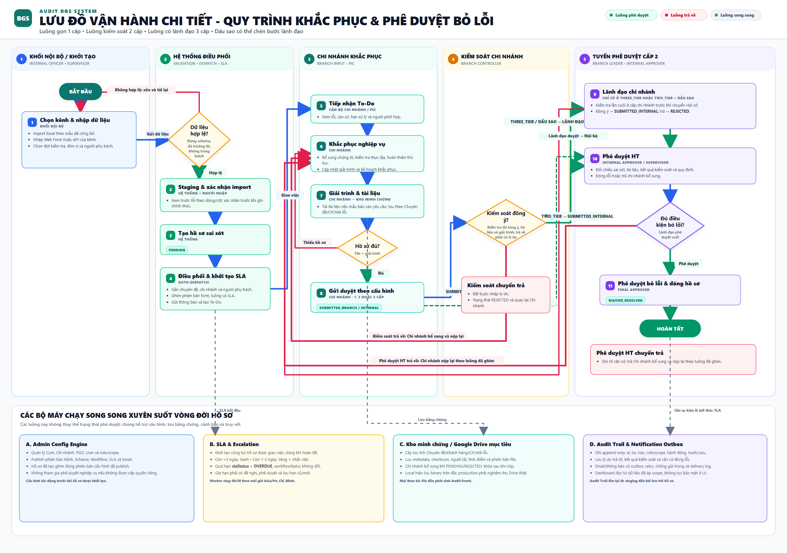

# AuditBGS — Hướng dẫn sử dụng

> Tài liệu dành cho người dùng nghiệp vụ: cán bộ Hội sở, cán bộ chi nhánh, kiểm soát chi nhánh, lãnh đạo chi nhánh và người phê duyệt Hội sở.
> Phiên bản tài liệu 2.0 · Cập nhật 29/08/2026

Đây là **tài liệu sử dụng** (một trong hai tài liệu nghiệp vụ chính). Phần cài đặt, cấu hình và lịch vận hành dành cho quản trị viên nằm ở [Hướng dẫn vận hành](./HUONG_DAN_VAN_HANH_CHI_TIET.md). Lưu đồ đầy đủ có thể xem tại [Lưu đồ vận hành](./LUU_DO_VAN_HANH_CHI_TIET.md) hoặc mở bản chỉnh sửa [Draw.io](./LUU_DO_VAN_HANH_CHI_TIET.drawio).

## 1. Bắt đầu nhanh

1. Đăng nhập bằng tài khoản được cấp.
2. Chọn **Hồ sơ khách hàng** để xem các phát hiện trong phạm vi của bạn.
3. Chọn đúng tab trạng thái, tìm theo CIF/khách hàng/mã lỗi rồi bấm **Mở hồ sơ**.
4. Đọc từng mã lỗi, thực hiện phần việc của vai trò và bấm đúng nút hành động.
5. Kiểm tra lịch sử xử lý sau mỗi lần nộp, chuyển, trả hoặc đóng lỗi.

> Người dùng chỉ nhìn thấy dữ liệu và nút thao tác mà vai trò, đơn vị và phạm vi dữ liệu của mình cho phép.

## 2. Đăng nhập và quyền truy cập

- Truy cập địa chỉ hệ thống do đơn vị cung cấp (production hiện dùng `https://bgrc.vercel.app`; môi trường local dùng `http://localhost:3000`).
- Đăng nhập bằng Google OIDC hoặc email/mật khẩu tùy môi trường đã cấu hình.
- Nếu dùng email/mật khẩu, chọn **Quên mật khẩu?** để nhận email khôi phục khi chức năng này đã được bật.
- Không chia sẻ mật khẩu, mã OTP, liên kết khôi phục hoặc tệp minh chứng có thông tin khách hàng.
- Nếu đăng nhập được nhưng không thấy hồ sơ, liên hệ Admin để kiểm tra vai trò và phạm vi chi nhánh/phòng ban.

## 3. Vai trò và việc được làm

| Vai trò | Công việc chính |
|---|---|
| `INTERNAL_OFFICER` | Nạp dữ liệu, tạo hồ sơ, theo dõi chuyên đề và kiểm tra tiến độ. |
| `BRANCH_INPUT` | Tiếp nhận hồ sơ, khắc phục từng mã lỗi, giải trình, tải minh chứng và gửi duyệt. |
| `BRANCH_CONTROLLER` | Kiểm tra hồ sơ chi nhánh, yêu cầu bổ sung hoặc chuyển lên bước tiếp theo. |
| `BRANCH_LEADER` | Duyệt hồ sơ thuộc tuyến có bước lãnh đạo chi nhánh hoặc trường hợp đặc biệt. |
| `SUPERVISOR` / `INTERNAL_APPROVER` | Phê duyệt Hội sở, đóng lỗi hoặc trả hồ sơ về chi nhánh. |
| `ADMIN` | Cấu hình người dùng, đơn vị, chuyên đề, loại báo cáo, workflow, SLA, tích hợp và nhật ký. |

**Cụm** chỉ là phạm vi địa bàn để lọc và báo cáo, không phải một cấp phê duyệt.

## 4. Màn hình chính

Thanh điều hướng có thể gồm:

- **Hồ sơ khách hàng**: danh sách và chi tiết phát hiện.
- **Nạp dữ liệu**: nhập Excel, ZIP, dán từ Excel, DOCX hoặc dữ liệu mẫu.
- **Báo cáo**: lọc, xem bảng/bảng chéo/biểu đồ và xuất dữ liệu.
- **Quản trị**: chỉ hiện với người có quyền quản trị.

*Hình 1 — Danh sách hồ sơ: lọc theo trạng thái, tìm theo CIF/khách hàng/mã lỗi và mở chi tiết.*

*Hình 2 — Trên điện thoại, thông tin CIF, khách hàng, đơn vị, mã lỗi và trạng thái được gom trong từng thẻ.*

## 5. Lưu đồ người dùng cần biết

Ảnh dưới đây là lưu đồ vận hành chuẩn, gồm luồng một cấp, luồng kiểm soát hai cấp, tuyến có lãnh đạo chi nhánh và các vòng trả bổ sung.

*Hình 3 — Lưu đồ vận hành: hệ thống điều phối, chi nhánh khắc phục, kiểm soát, lãnh đạo chi nhánh và phê duyệt Hội sở.*

### 5.1 Trạng thái hồ sơ

| Mã trạng thái | Hiển thị | Người xử lý tiếp |
|---|---|---|
| `PENDING` | Chờ chi nhánh khắc phục | `BRANCH_INPUT` |
| `SUBMITTED_BRANCH` | Chờ kiểm soát chi nhánh | `BRANCH_CONTROLLER` |
| `SUBMITTED_BRANCH_LEADER` | Chờ lãnh đạo chi nhánh | `BRANCH_LEADER` |
| `SUBMITTED_INTERNAL` | Chờ phê duyệt HT | `SUPERVISOR` / `INTERNAL_APPROVER` |
| `REJECTED` | Cần bổ sung | `BRANCH_INPUT` |
| `WAIVED_RESOLVED` | Đã đóng lỗi | Không còn thao tác nghiệp vụ |

`ON_TRACK`, `DUE_SOON`, `OVERDUE` và `CLOSED` là trạng thái **SLA độc lập**; SLA không tự chuyển bước phê duyệt.

### 5.2 Tuyến duyệt

- **Một cấp (`ONE_TIER`)**: Chi nhánh → Phê duyệt HT.
- **Hai cấp (`TWO_TIER`)**: Chi nhánh → Kiểm soát chi nhánh → Phê duyệt HT.
- **Có lãnh đạo (`THREE_TIER`)**: Chi nhánh → Kiểm soát chi nhánh → Lãnh đạo chi nhánh → Phê duyệt HT. Tuyến này cũng có thể được kích hoạt cho hồ sơ đánh dấu **Trường hợp đặc biệt**.
- Khi bị trả, hồ sơ về `REJECTED`, kèm lý do, người trả và thời điểm. Khi nộp lại, hồ sơ đi đúng tuyến đã được ghim trong phiên bản cấu hình; không tự đổi tuyến giữa chừng.

## 6. Nạp dữ liệu và tạo hồ sơ

Chỉ người có quyền nhập liệu mới thấy **Nạp dữ liệu**. Mọi nguồn dữ liệu đều đi qua ba bước: **staging → kiểm tra lỗi → lưu hồ sơ chính thức**.

### 6.1 Nhiều tệp Excel

1. Chọn **Loại báo cáo** và **Chuyên đề**.
2. Chọn **Nhiều tệp Excel** rồi tải một hoặc nhiều tệp `.xlsx`, `.xls` hoặc `.csv`.
3. Kiểm tra số khách hàng, số mã lỗi, chi nhánh, số quyết định và các dòng lỗi.
4. Sửa tệp hoặc dữ liệu staging nếu cần; không xác nhận khi còn dòng bắt buộc bị lỗi.

### 6.2 Tệp ZIP

- Chọn **Tệp ZIP** và tải một tệp `.zip` chứa các tệp Excel.
- Kiểm tra từng kết quả đọc; hệ thống vẫn hiển thị tệp nào lỗi để xử lý riêng.
- Không tải ZIP không rõ nguồn hoặc chứa tệp thực thi.

### 6.3 Dán từ Excel

- Chọn **Dán từ Excel**, sao chép vùng dữ liệu từ bảng tính rồi dán vào khung văn bản.
- Giữ dòng tiêu đề và thứ tự cột theo mẫu đã thống nhất.
- Bấm xử lý, kiểm tra staging rồi mới lưu hồ sơ.

### 6.4 Tệp DOCX có bảng sai sót

Chức năng DOCX đã dùng được cho bảng sai sót, không còn là mục “đang bổ sung”.

1. Chọn **Tệp DOCX**.
2. Tải `.docx` có bảng tối thiểu các cột **Tên khách hàng, CIF, Mã chi nhánh, Mã sai sót**.
3. Kiểm tra số dòng được tách, mã lỗi, chi nhánh và hồ sơ chuyên đề được điền trước.
4. Chọn hoặc tạo chuyên đề, kiểm tra cảnh báo rồi lưu staging.

Nếu tệp DOCX không đúng cấu trúc, dùng Excel hoặc biểu mẫu web để nhập lại; không sửa trực tiếp dữ liệu đã commit bằng cách nạp lặp.

### 6.5 Dữ liệu mẫu và biểu mẫu web

- **Nạp dữ liệu mẫu** chỉ dùng cho đào tạo/UAT, không dùng làm dữ liệu nghiệp vụ production.
- Với một phát hiện lẻ, chọn biểu mẫu web hoặc **Tạo hồ sơ**, nhập đủ CIF, khách hàng, chi nhánh, mã lỗi, nội dung và hạn xử lý.

## 7. Xử lý một hồ sơ

### 7.1 Cán bộ chi nhánh (`BRANCH_INPUT`)

1. Mở hồ sơ ở trạng thái `PENDING` hoặc `REJECTED`.
2. Chọn từng mã lỗi trong thanh mã lỗi; đọc mô tả và hạn xử lý.
3. Nhập biện pháp khắc phục và giải trình có thể kiểm chứng.
4. Nếu báo cáo yêu cầu, tải minh chứng rồi chờ trạng thái **Khả dụng**.
5. Có thể dùng **Tiếp nhận công việc**, **Theo dõi** và **Ưu tiên giám sát**; ba trạng thái này độc lập.
6. Bấm **Nộp kiểm soát** hoặc **Gửi duyệt** theo nút hiện trên màn hình.

Sau khi nộp, nội dung và minh chứng bị khóa ở cấp chi nhánh cho tới khi hồ sơ được trả về.

### 7.2 Kiểm soát chi nhánh (`BRANCH_CONTROLLER`)

1. Mở nhóm **Chờ kiểm soát**.
2. Đối chiếu từng mã lỗi, giải trình và minh chứng; không chỉ kiểm tra phần tổng quan.
3. Hồ sơ đạt: bấm **Chuyển phê duyệt HT** hoặc **Chuyển duyệt**.
4. Hồ sơ chưa đạt: nhập lý do cụ thể rồi bấm **Trả chi nhánh bổ sung**.

Hồ sơ thường chuyển thẳng Hội sở; hồ sơ thuộc tuyến có lãnh đạo chuyển sang `SUBMITTED_BRANCH_LEADER`.

### 7.3 Lãnh đạo chi nhánh (`BRANCH_LEADER`)

1. Mở nhóm **Chờ lãnh đạo CN**.
2. Kiểm tra ý kiến kiểm soát, nội dung khắc phục và minh chứng.
3. Bấm **Duyệt** để chuyển Hội sở hoặc **Trả chi nhánh bổ sung** kèm lý do.

### 7.4 Phê duyệt Hội sở (`SUPERVISOR` / `INTERNAL_APPROVER`)

1. Mở nhóm **Chờ phê duyệt HT**.
2. Đối chiếu nội dung, từng mã lỗi, lịch sử, hạn xử lý và tài liệu.
3. Nếu đạt, nhập số quyết định/công văn (nếu được yêu cầu) rồi bấm **Đóng lỗi**.
4. Nếu chưa đạt, bấm **Trả chi nhánh bổ sung** và ghi rõ phần cần sửa.

Đóng lỗi chuyển hồ sơ sang `WAIVED_RESOLVED` và SLA sang `CLOSED`.

## 8. Minh chứng

- Định dạng được hỗ trợ: **PDF, DOCX, XLSX, JPG, PNG** đúng phần mở rộng và MIME type.
- Kích thước tối đa: **25 MB/tệp**.
- Chỉ được thêm, thu hồi hoặc thay thế minh chứng khi hồ sơ ở `PENDING` hoặc `REJECTED`.
- Mỗi tệp có tên, loại, kích thước, checksum SHA-256, người tải và thời điểm.
- Tùy môi trường, tệp nằm trong kho local (phát triển/UAT) hoặc Google Drive thật (production). Không coi trạng thái “đã ghi metadata” là đã nghiệm thu Drive production.

## 9. SLA và ưu tiên

- `ON_TRACK`: còn trên 3 ngày.
- `DUE_SOON`: còn 1–3 ngày.
- `OVERDUE`: đã quá hạn.
- `CLOSED`: hồ sơ đã đóng.

Worker SLA chạy theo lịch cấu hình (mặc định 08:30 giờ Việt Nam) và khi hồ sơ thay đổi. SLA chỉ cảnh báo, sắp xếp ưu tiên và gửi thông báo; không tự duyệt hoặc trả hồ sơ.

## 10. Báo cáo

1. Vào **Báo cáo** và chọn mẫu được Admin cấp.
2. Lọc theo chuyên đề, loại báo cáo, chi nhánh/phòng, CIF, mã lỗi, trạng thái hoặc SLA.
3. Chọn **Bảng**, **Bảng chéo** hoặc **Biểu đồ**.
4. Bấm **Lưu cách xem** nếu muốn dùng lại; mẫu chia sẻ vẫn không mở rộng quyền dữ liệu.
5. Xuất **CSV, XLSX hoặc HTML** tùy quyền.

*Hình 4 — Không gian báo cáo; bộ lọc và cột hiển thị phụ thuộc cấu hình loại báo cáo.*

## 11. Khi gặp lỗi

| Hiện tượng | Cách xử lý |
|---|---|
| Không thấy hồ sơ | Kiểm tra chuyên đề, chi nhánh, vai trò và phạm vi dữ liệu. |
| Không thấy nút gửi duyệt | Kiểm tra giải trình, minh chứng bắt buộc, từng mã lỗi và trạng thái hiện tại. |
| Hồ sơ bị trả | Đọc lý do trong lịch sử, sửa đúng phần được yêu cầu rồi nộp lại. |
| Không sửa được minh chứng | Hồ sơ đã nộp; chờ cấp duyệt trả về `REJECTED`. |
| Minh chứng báo lỗi | Kiểm tra loại tệp, MIME, kích thước 25 MB và kết nối kho lưu trữ. |
| SLA chưa đổi | Kiểm tra hạn xử lý và thời điểm worker; không sửa `workflowStatus` bằng tay. |
| Số liệu khác đồng nghiệp | Hai người có thể khác phạm vi dữ liệu hoặc vai trò; dùng cùng bộ lọc để đối chiếu. |

## 12. Tài liệu liên quan

- [Hướng dẫn vận hành](./HUONG_DAN_VAN_HANH_CHI_TIET.md) — cấu hình, checklist, lịch kiểm tra và xử lý sự cố cho quản trị viên.
- [Lưu đồ vận hành](./LUU_DO_VAN_HANH_CHI_TIET.md) — trạng thái, tuyến duyệt, SLA, minh chứng và audit trail.
- [Bản Draw.io chỉnh sửa được](./LUU_DO_VAN_HANH_CHI_TIET.drawio).
- [Cài đặt và cấu hình production](./docs/HUONG_DAN_CAI_DAT_SU_DUNG_VAN_HANH_AUDITBGS.md).

Liên hệ hỗ trợ: **Quản trị viên Hội sở (`ADMIN`)**.
