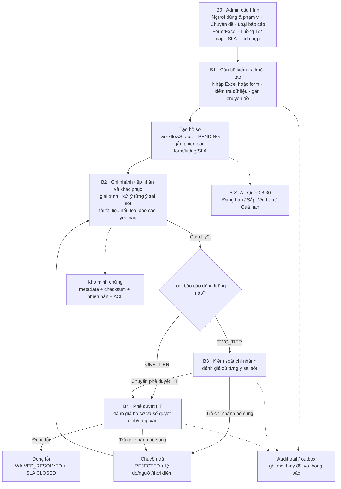
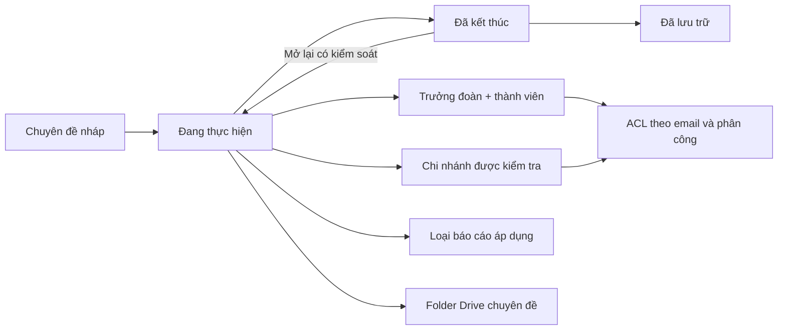
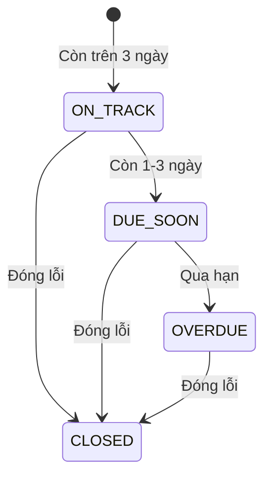

# Lưu đồ vận hành AuditBGS

> Bản đồng bộ với code ngày 25/08/2026. Cụm chỉ là phạm vi địa bàn; cấp kiểm tra trung gian là **Kiểm soát chi nhánh (`BRANCH_CONTROLLER`)**. Hệ thống hỗ trợ luồng một cấp và hai cấp theo phiên bản loại báo cáo.

## 1. Quy ước trạng thái

| Trạng thái | Ý nghĩa | Người xử lý tiếp |
|---|---|---|
| `PENDING` | Chi nhánh đang khắc phục | Cán bộ chi nhánh |
| `SUBMITTED_BRANCH` | Chờ kiểm soát chi nhánh | Kiểm soát chi nhánh |
| `SUBMITTED_INTERNAL` | Chờ phê duyệt HT | Phê duyệt HT/Lãnh đạo khối |
| `REJECTED` | Chi nhánh cần bổ sung | Cán bộ chi nhánh |
| `WAIVED_RESOLVED` | Đã đóng lỗi, trạng thái cuối | Không còn thao tác nghiệp vụ |

`ON_TRACK`, `DUE_SOON`, `OVERDUE`, `CLOSED` là trạng thái SLA độc lập. Worker SLA không được đổi trạng thái phê duyệt.

## 2. Luồng tổng thể



## 3. Hai loại luồng phê duyệt

### Luồng kiểm soát (`TWO_TIER`)

```text
PENDING/REJECTED
  → Cán bộ chi nhánh: Gửi kiểm soát chi nhánh
  → SUBMITTED_BRANCH
  → Kiểm soát chi nhánh: Chuyển phê duyệt HT hoặc Trả chi nhánh bổ sung
  → SUBMITTED_INTERNAL
  → Phê duyệt HT: Đóng lỗi hoặc Trả chi nhánh bổ sung
  → WAIVED_RESOLVED hoặc REJECTED
```

### Luồng gọn (`ONE_TIER`)

```text
PENDING/REJECTED
  → Cán bộ chi nhánh gửi duyệt
  → SUBMITTED_INTERNAL
  → Phê duyệt HT: Đóng lỗi hoặc Trả chi nhánh bổ sung
  → WAIVED_RESOLVED hoặc REJECTED
```

Khi hồ sơ bị trả ở bất kỳ cấp nào, hồ sơ quay về `REJECTED`. Lần nộp lại tuân theo đúng loại luồng đã ghim ở phiên bản hồ sơ; không đổi luồng giữa chừng.

## 4. Chuyên đề và phân quyền



- Admin thấy toàn bộ; thành viên thấy chuyên đề được phân công; người dùng chi nhánh chỉ thấy phạm vi chi nhánh của mình.
- Cờ **Ưu tiên giám sát** độc lập với **Tiếp nhận công việc** và **Theo dõi**.
- Cụm được dùng để lọc, báo cáo và gom địa bàn; không phải một cấp phê duyệt.

## 5. Tài liệu và bằng chứng

- Cán bộ chi nhánh chỉ được thêm/thu hồi tài liệu khi hồ sơ ở `PENDING` hoặc `REJECTED`.
- Sau khi nộp, tài liệu bị khóa sửa ở cấp chi nhánh; cấp kiểm soát/phê duyệt chỉ xem và đánh giá.
- Loại báo cáo có thể không yêu cầu tài liệu (`FORM_ONLY`/tắt đính kèm); khi đó dữ liệu form là nội dung xử lý chính.
- Mọi tệp hợp lệ có MIME, kích thước, checksum, người tải, thời điểm và phiên bản.
- Hiện tại binary trên local vẫn nằm trong `data/drive_storage`. Apps Script đã hỗ trợ tạo folder chuyên đề và ACL; production chỉ được mở khi upload/stream binary qua Google Drive thật đã nghiệm thu.

Cây Drive mục tiêu:

```text
THU_MUC_GOC/
  MA_CHUYEN_DE_TEN_CHUYEN_DE/
    QUYET_DINH/
    BAO_CAO/
    KHACH_HANG/
      CIF_TEN_KHACH_HANG/
        LOI_MA_LOI/
```

## 6. SLA và thông báo



- Quét lúc 08:30 `Asia/Ho_Chi_Minh`.
- Cập nhật `slaStatus` và cờ quá hạn; không tự phê duyệt hoặc chuyển bước.
- Email/nhắc việc phải đi qua outbox có retry và chống gửi trùng ở production.
- Gia hạn phải lưu người duyệt, lý do, hạn cũ, hạn mới và audit event.

## 7. Phiên bản cấu hình

- Loại báo cáo lưu phiên bản form, trường, mapping Excel, cách trình bày, chính sách đính kèm, luồng và SLA.
- Hồ sơ mới dùng phiên bản đang áp dụng tại thời điểm tạo.
- Sửa cấu hình chỉ áp dụng cho hồ sơ tạo sau; không âm thầm đổi hồ sơ đang xử lý.
- Loại báo cáo đã có dữ liệu không xóa vật lý; chuyển sang tạm ngừng để bảo toàn lịch sử.
