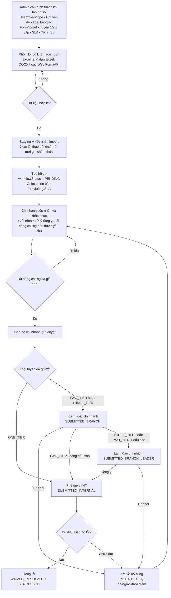
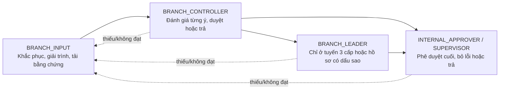
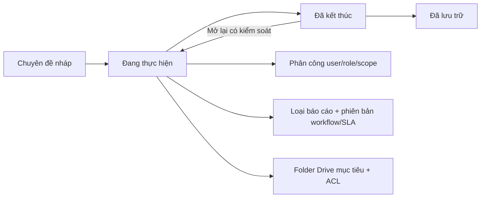

# Lưu đồ vận hành AuditBGS

> Bản đối chiếu mã nguồn ngày 29/08/2026. Lưu đồ này phản ánh đúng ba loại tuyến phê duyệt đang có trong app, trạng thái `workflowStatus`, vòng trả về và các bộ máy chạy song song.

- [Mở bản chỉnh sửa Draw.io](./LUU_DO_VAN_HANH_CHI_TIET.drawio)
- [Hướng dẫn sử dụng](./HUONG_DAN_SU_DUNG.md)
- [Hướng dẫn vận hành chi tiết](./HUONG_DAN_VAN_HANH_CHI_TIET.md)

## 1. Quy ước trạng thái

| Trạng thái | Ý nghĩa | Người xử lý tiếp |
|---|---|---|
| `PENDING` | Chi nhánh đang khắc phục | Cán bộ chi nhánh |
| `SUBMITTED_BRANCH` | Chi nhánh đã nộp, chờ Kiểm soát chi nhánh | `BRANCH_CONTROLLER` |
| `SUBMITTED_BRANCH_LEADER` | Kiểm soát đã đồng ý, chờ Lãnh đạo chi nhánh | `BRANCH_LEADER` |
| `SUBMITTED_INTERNAL` | Chờ Khối Nội Bộ phê duyệt | `INTERNAL_APPROVER` / `SUPERVISOR` |
| `REJECTED` | Bị trả về để bổ sung, kèm lý do và nơi trả | Cán bộ chi nhánh |
| `WAIVED_RESOLVED` | Đã phê duyệt bỏ lỗi, trạng thái cuối | Không còn thao tác nghiệp vụ |

`ON_TRACK`, `DUE_SOON`, `OVERDUE`, `CLOSED` là trạng thái SLA độc lập. Worker SLA chỉ cập nhật SLA và nhắc việc; không tự chuyển bước phê duyệt.

## 2. Luồng tổng thể theo app hiện tại

### Các điểm đã kiểm tra trong code

- `ONE_TIER`: nộp từ `PENDING`/`REJECTED` đi thẳng tới `SUBMITTED_INTERNAL`.
- `TWO_TIER`: nộp tới `SUBMITTED_BRANCH`; Kiểm soát chi nhánh duyệt thẳng lên Hội sở nếu hồ sơ bình thường.
- `TWO_TIER` có **dấu sao Trường hợp đặc biệt**: sau Kiểm soát chi nhánh chèn bắt buộc bước `SUBMITTED_BRANCH_LEADER`, rồi mới lên Hội sở.
- `THREE_TIER`: luôn đi `SUBMITTED_BRANCH` → `SUBMITTED_BRANCH_LEADER` → `SUBMITTED_INTERNAL`.
- Kiểm soát chi nhánh, Lãnh đạo chi nhánh và Phê duyệt HT đều có nhánh chuyển trả về `REJECTED`; cán bộ chi nhánh bổ sung rồi nộp lại theo tuyến đã ghim.
- `WAIVED_RESOLVED` là trạng thái cuối; không được sửa hoặc chạy lại thao tác nghiệp vụ.

## 3. Bảng tuyến phê duyệt

| Cấu hình | Tuyến thực tế | Trạng thái trung gian |
|---|---|---|
| `ONE_TIER` — Luồng gọn | Chi nhánh → Phê duyệt HT | `SUBMITTED_INTERNAL` |
| `TWO_TIER` — Luồng kiểm soát | Chi nhánh → Kiểm soát chi nhánh → Phê duyệt HT | `SUBMITTED_BRANCH` → `SUBMITTED_INTERNAL` |
| `TWO_TIER` + dấu sao | Chi nhánh → Kiểm soát chi nhánh → Lãnh đạo chi nhánh → Phê duyệt HT | `SUBMITTED_BRANCH` → `SUBMITTED_BRANCH_LEADER` → `SUBMITTED_INTERNAL` |
| `THREE_TIER` — Luồng có lãnh đạo | Chi nhánh → Kiểm soát chi nhánh → Lãnh đạo chi nhánh → Phê duyệt HT | `SUBMITTED_BRANCH` → `SUBMITTED_BRANCH_LEADER` → `SUBMITTED_INTERNAL` |

Dấu sao là thuộc tính theo khách hàng/chi nhánh, bật khi hồ sơ còn `PENDING` hoặc `REJECTED`; bật dấu sao cũng đưa khách hàng vào danh sách Theo dõi của người thao tác. Sau khi hồ sơ đã nộp, dấu sao bị khóa.

## 4. Quyền và trách nhiệm trên tuyến

- `ADMIN`, `INTERNAL_OFFICER` quản trị cấu hình, dữ liệu, phân quyền và import; không tự trở thành người phê duyệt nếu không có role tương ứng.
- Kiểm soát/Lãnh đạo chi nhánh chỉ xử lý hồ sơ trong phạm vi chi nhánh và đúng trạng thái của mình.
- API là nơi áp quyền và scope; giao diện chỉ hiển thị nút phù hợp, không phải lớp bảo mật cuối.

## 5. Bằng chứng, SLA và truy vết chạy song song

- Bằng chứng có MIME, kích thước tối đa 25 MB, checksum, người tải, thời điểm và phiên bản; chi nhánh chỉ thêm/thu hồi khi `PENDING` hoặc `REJECTED`.
- Khi hồ sơ đã nộp, tài liệu cấp chi nhánh bị khóa sửa; cấp kiểm soát/phê duyệt chỉ xem và đánh giá.
- SLA quét lúc 08:30 theo `Asia/Ho_Chi_Minh`: `ON_TRACK` → `DUE_SOON` → `OVERDUE`; khi đóng hồ sơ thì `CLOSED`. SLA không thay thế `workflowStatus`.
- Mọi nộp, duyệt, trả, đổi dấu sao, upload và gia hạn phải có audit event; thông báo production đi qua outbox có retry và chống gửi trùng.
- Local hiện còn lưu binary ở `data/drive_storage`; production chỉ được coi là sẵn sàng sau khi nghiệm thu Drive thật và secret triển khai.

## 6. Chuyên đề và phiên bản cấu hình

- Cấu hình loại báo cáo lưu version của form, mapping, presentation mode, chính sách bằng chứng, workflow và SLA.
- Hồ sơ mới ghim version tại thời điểm tạo; sửa cấu hình không âm thầm đổi hồ sơ đang xử lý.
- Loại báo cáo đã có dữ liệu không xóa vật lý; chuyển tạm ngừng để bảo toàn lịch sử.
