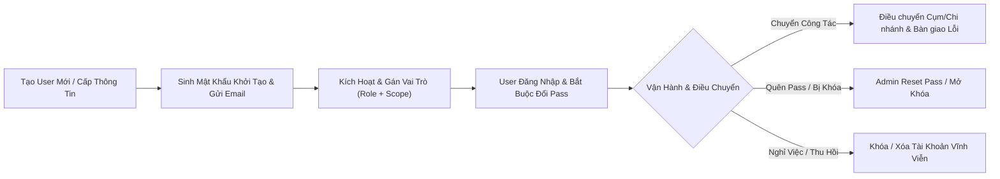

# TÀI LIỆU THIẾT KẾ TOÀN DIỆN TRUNG TÂM ĐIỀU HÀNH QUẢN TRỊ (ADMIN PORTAL BLUEPRINT)
## HỆ THỐNG XỬ LÝ LỖI & THEO DÕI KHẮC PHỤC KIỂM TOÁN (AUDIT BGS SYSTEM)

---

## 1. TỔNG QUAN VỀ VAI TRÒ & PHẠM VI QUẢN TRỊ CỦA ADMIN

Quản trị viên (Admin) là trung tâm đầu não của hệ thống, chịu trách nhiệm quản trị 4 trụ cột cốt lõi:
1. **Cơ cấu Tổ chức Toàn Hàng**: Quản lý cây phân cấp Cụm $\rightarrow$ Chi nhánh $\rightarrow$ Phòng ban / Phòng Giao dịch.
2. **Quản lý Định danh & Phân quyền Người dùng (User Lifecycle & RBAC/ABAC)**: Cấp phát tài khoản, mật khẩu, điều chuyển nhân sự, phân quyền vai trò và phạm vi dữ liệu truy cập.
3. **Cấu hình Nghiệp vụ Mở & Đa Kênh (Extensible Business Engines)**: Tự tạo kênh báo cáo mới, thiết kế form/cột Excel động, thiết lập số cấp duyệt linh hoạt.
4. **Cấu hình Vận hành & Tích hợp (SLA, Email, Google Drive, Security Logs)**: Thiết lập hạn chót, mẫu thông báo tự động, cấu hình lưu trữ Drive và giám sát nhật ký an ninh toàn hệ thống.

```
┌────────────────────────────────────────────────────────────────────────────────────────┐
│                        TRUNG TÂM ĐIỀU HÀNH QUẢN TRỊ (ADMIN CONTROL CENTER)             │
├────────────────────────────┬────────────────────────────┬──────────────────────────────┤
│ 🏢 CƠ CẤU TỔ CHỨC          │ 👥 QUẢN TRỊ NGƯỜI DÙNG     │ ⚙️ CẤU HÌNH NGHIỆP VỤ MỞ      │
│ • Quản lý Danh mục Cụm     │ • Thêm/Sửa/Xóa/Khóa User   │ • Quản lý Kênh Báo Cáo       │
│ • Quản lý Chi Nhánh        │ • Cấp Mật Khẩu / Reset Pass│ • Dynamic Schema & Form      │
│ • Quản lý Phòng Giao Dịch  │ • Điều chuyển Đơn vị       │ • Cấu hình Luồng Duyệt       │
│ • Gán Lãnh đạo Đơn vị      │ • Ma trận Phân quyền (RBAC)│ • SLA & Mẫu Email Tự Động    │
├────────────────────────────┴────────────────────────────┴──────────────────────────────┤
│ 🔌 TÍCH HỢP & AN NINH HỆ THỐNG                                                         │
│ • Cấu hình Google Drive Root Folder & API Key    • Giám sát Nhật ký Audit Trail 100%   │
│ • Quản lý Backup / Khôi phục Dữ liệu             • Quản lý Phiên Đăng Nhập & Bảo Mật   │
└────────────────────────────────────────────────────────────────────────────────────────┘
```

---

## 2. QUẢN LÝ CƠ CẤU TỔ CHỨC (CỤM - CHI NHÁNH - PHÒNG BAN)

Admin có toàn quyền thiết lập và điều chỉnh cấu trúc mạng lưới chi nhánh toàn quốc:

### 2.1. Quản lý Danh mục Cụm (Cluster Management)
- **Thông tin quản lý**:
  - Mã Cụm (Code: `TAY_NGUYEN`, `TP_HCM`, `MIEN_BAC`, `TAY_NAM_BO`...).
  - Tên Cụm hiển thị (*Cụm Tây Nguyên, Cụm TP. Hồ Chí Minh...*).
  - Giám đốc Cụm phụ trách (Chọn từ danh sách User).
  - Trạng thái (Hoạt động / Tạm khóa).
- **Thao tác Admin**: Thêm Cụm mới, đổi tên/mã và xem danh sách chi nhánh trực thuộc. Cụm là phạm vi địa bàn, không phải cấp phê duyệt.

### 2.2. Quản lý Danh mục Chi nhánh (Branch Management)
- **Thông tin quản lý**:
  - Mã Chi Nhánh (Branch Code: `635`, `428`, `102`...).
  - Tên Chi Nhánh (*CN Nam Buôn Hồ, CN Bình Tây Sài Gòn, CN Hà Nội...*).
  - Trực thuộc Cụm nào (Dropdown chọn Cụm).
  - Địa chỉ / Khu vực / Số điện thoại liên hệ.
  - Giám đốc Chi nhánh phụ trách.
  - Số lượng nhân sự & Số lượng hồ sơ lỗi đang xử lý.
- **Thao tác Admin**: Thêm Chi nhánh mới, Chỉnh sửa thông tin, Chuyển Chi nhánh sang Cụm khác, Tạm dừng hoạt động.

### 2.3. Quản lý Phòng Ban / Phòng Giao Dịch (Department / PGD Management)
- **Thông tin quản lý**:
  - Mã PGD / Tên Phòng (*PGD Nam Buôn Hồ 1, Phòng Quản lý Khách hàng 1, Phòng Kế toán & Vận hành...*).
  - Trực thuộc Chi nhánh nào.
  - Trưởng phòng / Trưởng PGD phụ trách.
- **Thao tác Admin**: Thêm mới, Sửa tên, Gán Trưởng phòng quản lý.

---

## 3. QUẢN TRỊ NGƯỜI DÙNG TOÀN DIỆN (USER LIFECYCLE MANAGEMENT)

Admin kiểm soát 100% vòng đời của tài khoản từ khi khởi tạo đến khi điều chuyển hoặc thu hồi:



### 3.1. Các Thao Tác Cốt Lõi Của Admin Với User:
1. **Thêm User Mới (Create User)**:
   - Điền: Họ và tên, Email doanh nghiệp (bắt buộc), Tên đăng nhập, Số điện thoại.
   - Chọn **Cổng làm việc (Portal Type)**: `INTERNAL` (Hội sở / Nội bộ) hoặc `BRANCH` (Cụm / Chi nhánh).
   - Chọn **Cơ cấu tổ chức**: Chọn Cụm $\rightarrow$ Chọn Chi nhánh $\rightarrow$ Chọn Phòng ban.
   - Chọn **Vai trò (Role)**: `ADMIN`, `SUPERVISOR`, `INTERNAL_APPROVER`, `INTERNAL_OFFICER`, `BRANCH_CONTROLLER`, `BRANCH_INPUT` hoặc `VIEWER`.
2. **Cấp Phát Mật Khẩu (Credential Provisioning)**:
   - **Tùy chọn 1 (Tự sinh ngẫu nhiên)**: Hệ thống sinh mật khẩu mạnh tạm thời (ví dụ: `Bgs@2026#Xy9`) và gửi thẳng vào Email của cán bộ.
   - **Tùy chọn 2 (Admin chỉ định)**: Admin nhập mật khẩu khởi tạo trực tiếp.
   - **Chính sách**: Bắt buộc người dùng phải đổi mật khẩu ngay trong lần đăng nhập đầu tiên.
3. **Chỉnh Sửa Thông Tin (Edit User)**:
   - Cập nhật số điện thoại, đổi email, cập nhật họ tên.
4. **Điều Chuyển Công Tác (Reassignment / Transfer)**:
   - Khi cán bộ chuyển từ *Chi nhánh Nam Buôn Hồ* sang *Chi nhánh Buôn Ma Thuột*:
     - Admin chọn Chi nhánh mới $\rightarrow$ Hệ thống tự động cập nhật phạm vi truy cập dữ liệu (Data Scope).
     - Cho phép Admin chọn **Bàn giao danh sách lỗi tồn đọng** cho một cán bộ khác tiếp quản chỉ bằng 1 cú click.
5. **Reset Mật Khẩu (Password Reset)**:
   - Khi user quên mật khẩu hoặc bị khóa do nhập sai quá 5 lần: Admin bấm nút **"Reset Mật Khẩu"** -> Hệ thống cấp lại mật khẩu tạm thời hoặc gửi link xác thực đặt lại qua Email.
6. **Khóa / Mở Khóa / Xóa Tài Khoản (Lock / Unlock / Delete)**:
   - **Khóa tạm thời (Deactivate)**: Chặn đăng nhập ngay lập tức (dành cho trường hợp cán bộ tạm nghỉ, đình chỉ).
   - **Xóa mềm (Soft Delete)**: Đưa vào lưu trữ, vẫn giữ nguyên lịch sử Audit Trail các hồ sơ cán bộ đã từng xử lý trước đây để phục vụ tra cứu.

---

## 4. MA TRẬN PHÂN QUYỀN ĐA TẦNG (RBAC & DATA SCOPE MATRIX)

Hệ thống kết hợp giữa **Role-Based Access Control (Quyền theo chức năng)** và **Attribute-Based Scope Filtering (Phạm vi dữ liệu theo địa bàn)**:

### 4.1. Bảng Chi Tiết Quyền Hạn Theo Vai Trò (Role Capabilities):

| Chức Năng Hệ Thống | ADMIN | SUPERVISOR / INTERNAL_APPROVER | INTERNAL_OFFICER | BRANCH_CONTROLLER | BRANCH_INPUT | VIEWER |
| :--- | :---: | :---: | :---: | :---: | :---: | :---: |
| **Quản lý Cụm, Chi Nhánh, User** | ✅ Toàn quyền | ❌ | ❌ | ❌ | ❌ | ❌ |
| **Cấu hình Kênh, Form, SLA, Email** | ✅ Toàn quyền | ❌ | ❌ | ❌ | ❌ | ❌ |
| **Import Excel / Tạo Sự Vụ Mới** | ✅ | ✅ | ✅ | ❌ | ❌ | ❌ |
| **Xem Chi Tiết Lỗi & Tài liệu**| ✅ | ✅ | ✅ | ✅ (Theo CN) | ✅ (Theo CN) | ✅ (Theo scope) |
| **Upload/thu hồi tài liệu khi PENDING/REJECTED**| ❌ | ❌ | ❌ | ❌ | ✅ | ❌ |
| **Kiểm soát chi nhánh và chuyển phê duyệt HT** | ❌ | ❌ | ❌ | ✅ | ❌ | ❌ |
| **Phê duyệt HT / Đóng lỗi** | ❌ | ✅ | ❌ | ❌ | ❌ | ❌ |
| **Xem Dashboard** | ✅ | ✅ | ✅ (Theo scope) | ✅ (CN mình) | ✅ (CN mình) | ✅ (Theo scope) |
| **Nhận Email Cảnh Báo Leo Thang** | ✅ | ✅ | ❌ | ✅ | ❌ | ❌ |

### 4.2. Bộ Lọc Phạm Vi Dữ Liệu Tự Động (Data Scope Engine):
- **Phạm vi Toàn hệ thống (`ALL`)**: chỉ dành cho tài khoản được cấp toàn hệ thống như Admin/Lãnh đạo khối.
- **Phạm vi Cụm (`CLUSTER`)**: phạm vi xem/lọc theo địa bàn; không tạo quyền phê duyệt ở cấp địa bàn.
- **Phạm vi Chi nhánh (`BRANCH`)**: `BRANCH_CONTROLLER` và `BRANCH_INPUT` chỉ thấy hồ sơ thuộc chi nhánh được cấp.
- **Phạm vi Phòng (`DEPARTMENT`)**: thu hẹp tiếp trong một chi nhánh khi cấu hình yêu cầu.

---

## 5. CÁC SETTING & CẤU HÌNH NGHIỆP VỤ MỞ DÀNH CHO ADMIN

Ngoài quản lý User và Đơn vị, Admin có toàn quyền cấu hình các "bộ máy thông minh" sau:

### 5.1. Quản lý Kênh Báo cáo (Dynamic Channel Setting)
- Thêm Kênh mới: Đặt mã (`AUDIT_BGS`, `AML`, `OP_RISK`, `CREDIT_THEMATIC`...).
- Chọn Icon, Màu sắc nhận diện, Đơn vị ban hành.
- Bật/Tắt tính năng cho phép Import Excel hoặc Nhập Form trực tiếp.

### 5.2. Cấu hình Trường Thông Tin Động (Dynamic Schema & Header Mapper)
- Thêm bớt các cột dữ liệu không giới hạn.
- Định nghĩa kiểu dữ liệu: Chữ, Số tiền (VNĐ), Ngày tháng, Danh mục Dropdown, File đính kèm.
- **Cấu hình Alias Cột Excel**: Khai báo danh sách tên cột tương đương để hệ thống tự nhận diện thông minh khi Import file.

### 5.3. Cấu hình Luồng Quy Trình Duyệt (Workflow & Approval Stage Builder)
- Thiết lập số cấp duyệt:
  - Luồng gọn (`ONE_TIER`): Chi nhánh $\rightarrow$ Phê duyệt HT.
  - Luồng kiểm soát (`TWO_TIER`): Chi nhánh $\rightarrow$ Kiểm soát chi nhánh $\rightarrow$ Phê duyệt HT.
- Gán quyền thao tác cho từng cấp: Ai được duyệt, Ai được trả về, Lý do bắt buộc khi từ chối.

### 5.4. Cấu hình SLA, Deadline & Mẫu Email Tự Động
- Cài đặt số ngày xử lý chuẩn theo từng Mức độ rủi ro (Nghiêm trọng: 7 ngày, Vừa: 15 ngày, Thấp: 30 ngày).
- Cấu hình Lịch trình gửi Email (Hàng ngày lúc 08:30 sáng).
- Cấu hình Mẫu Email Template với các biến động: `{{ten_khach_hang}}`, `{{ma_cif}}`, `{{ma_loi}}`, `{{ten_chi_nhanh}}`, `{{so_ngay_con_lai}}`, `{{link_truy_cap}}`.
- Danh sách nhận Email cảnh báo quá hạn theo vai trò: cán bộ phụ trách, kiểm soát chi nhánh, lãnh đạo chi nhánh và phê duyệt HT.

### 5.5. Cấu hình Tích hợp Google Drive & Hạn Mức File
- Cấu hình `Google Drive Folder ID` gốc của toàn hệ thống.
- Cấu hình Service Account JSON hoặc OAuth Client ID kết nối.
- Cài đặt định dạng file cho phép (`pdf, docx, xlsx, jpg, png`) và dung lượng tối đa (ví dụ: `25MB`).

### 5.6. Nhật Ký An Ninh & Giám Sát Hoạt Động (Audit Trail & Activity Log)
- Xem lại lịch sử 100% các hành động trên hệ thống:
  - *Ai đã tạo user mới? Lúc mấy giờ? Từ IP nào?*
  - *Ai đã reset mật khẩu cho cán bộ X?*
  - *Ai đã thay đổi cấu hình luồng duyệt?*
  - *Ai đã duyệt bỏ lỗi cho khoản vay CIF 123456?*

---

## 6. THIẾT KẾ CÁC MÀN HÌNH QUẢN TRỊ TRONG GIAO DIỆN ADMIN PORTAL

```
┌────────────────────────────────────────────────────────────────────────────────────────┐
│ ⚙️ BAN ĐIỀU HÀNH QUẢN TRỊ HỆ THỐNG (ADMIN PORTAL)                      [Admin: Nguyen Van A]│
├───────────────┬────────────────────────────────────────────────────────────────────────┤
│ 🏢 Đơn vị     │ 👥 DANH SÁCH NGƯỜI DÙNG TOÀN HÀNG                   [+ Thêm User Mới]   │
│   • Cụm       ├────────────────────────────────────────────────────────────────────────┤
│   • Chi nhánh │ [Tìm theo Tên/Email/CIF...] [Lọc Cụm: Tất cả ▾] [Lọc Role: Tất cả ▾]   │
│   • Phòng ban ├────────────────────────────────────────────────────────────────────────┤
│ 👥 Người dùng │ Họ tên        | Email            | Cụm / Chi nhánh   | Role      | Thao tác │
│ ⚙️ Kênh Báo cáo│ Nguyễn Văn B  | b.nv@bank.com    | Tây Nguyên / 635  | Cán bộ    | ✏️ 🔑 🔒 │
│ 📋 Schema/Form│ Trần Thị C    | c.tt@bank.com    | Tây Nguyên / Cụm  | Lãnh đạo  | ✏️ 🔑 🔒 │
│ 🔀 Luồng duyệt│ Lê Văn D      | d.lv@bank.com    | Khối Kiểm Toán    | Kiểm toán | ✏️ 🔑 🔒 │
│ ⏰ SLA & Email │ Phạm Hoàng E  | e.ph@bank.com    | Ban Giám Đốc      | Lãnh đạo  | ✏️ 🔑 🔒 │
│ 📁 Google Drive│ ...           | ...              | ...               | ...       | ...      │
│ 📜 Audit Log  │                                                                        │
└───────────────┴────────────────────────────────────────────────────────────────────────┘
```

---

*Tài liệu này là chuẩn thiết kế kỹ thuật và nghiệp vụ hoàn chỉnh cho Module Quản trị Hệ thống (Admin Portal).*
