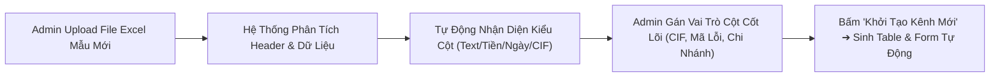
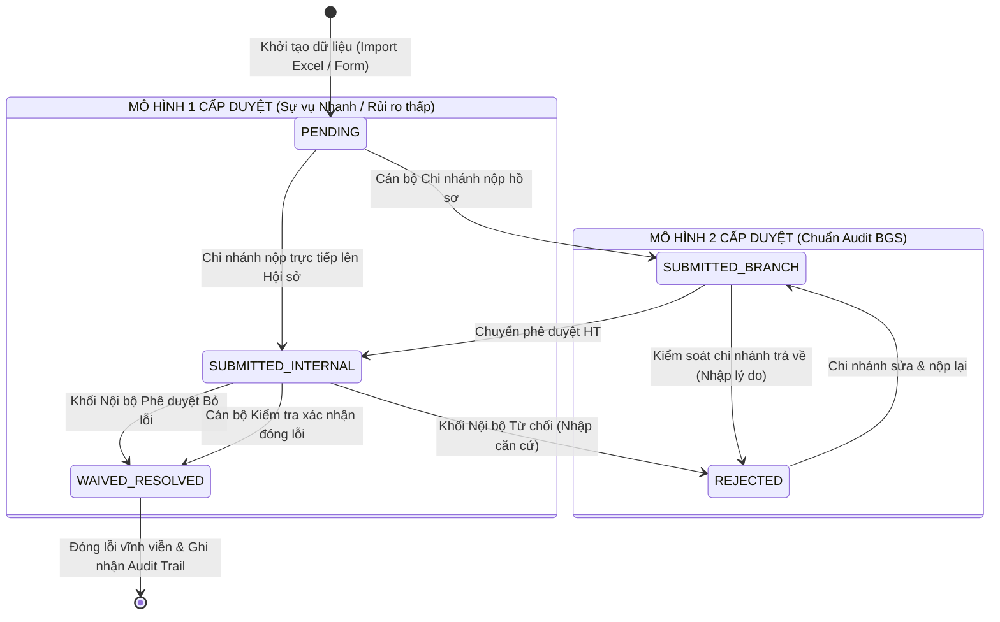

# THIẾT KẾ BỘ MÁY TẠO KÊNH BÁO CÁO MỚI, UPLOAD MẪU EXCEL & PHÂN QUYỀN NÚT BẤM (BUTTON-LEVEL RBAC & DYNAMIC WORKFLOW ENGINE)
## HỆ THỐNG XỬ LÝ LỖI & THEO DÕI KHẮC PHỤC KIỂM TOÁN (AUDIT BGS SYSTEM)

---

## 1. TỔNG QUAN KIẾN TRÚC MỞ & CƠ CHẾ NÂNG CẤP ĐỘNG (EXTENSIBLE ENGINE)

Hệ thống ban đầu được thiết kế theo mẫu *Kiểm tra thường xuyên*. Tuy nhiên, để đáp ứng khả năng mở rộng không giới hạn mà không cần can thiệp vào mã nguồn (Zero-Code Extension), chúng ta xây dựng **4 bộ máy cấu hình động cốt lõi**:

```
┌────────────────────────────────────────────────────────────────────────────────────────┐
│               TRUNG TÂM CẤU HÌNH KÊNH & LUỒNG BÁO CÁO MỚI (DYNAMIC REPORT HUB)         │
├────────────────────────────┬────────────────────────────┬──────────────────────────────┤
│ 📤 1. TẢI MẪU EXCEL MỚI    │ 🔲 2. THIẾT KẾ BẢNG TABLE   │ 🎛️ 3. PHÂN QUYỀN NÚT BẤM     │
│ • Upload file Excel mẫu    │ • Thêm bớt cột linh hoạt   │ • Button Permission Matrix   │
│ • Tự động nhận diện Header │ • Định nghĩa kiểu dữ liệu  │ • Phân quyền theo Role/Scope │
│ • Tự sinh Schema & Table   │ • Cấu hình Validate/Regex  │ • Trạng thái Ẩn/Hiện/Khóa    │
├────────────────────────────┴────────────────────────────┴──────────────────────────────┤
│ 🔀 4. BỘ MÁY XÂY DỰNG LUỒNG DUYỆT TÙY BIẾN (WORKFLOW STATE MACHINE BUILDER)           │
│ • Tạo luồng 1 cấp, 2 cấp hoặc n-cấp duyệt linh hoạt cho từng Kênh                     │
│ • Cấu hình Điều kiện chuyển trạng thái (State Transitions) & Rẽ nhánh duyệt/từ chối   │
│ • Tự động kích hoạt Email, SLA và Ghi nhận Audit Trail theo từng bước                 │
└────────────────────────────────────────────────────────────────────────────────────────┘
```

---

## 2. LUỒNG TẠO HỆ THỐNG KÊNH BÁO CÁO MỚI & UPLOAD MẪU FILE EXCEL

Admin có 2 phương thức cực kỳ linh hoạt để tạo ra một Kênh Báo cáo Nghiệp vụ hoàn toàn mới:

### 2.1. Phương Thức 1: Tự Động Sinh Bảng Dữ Liệu Từ File Excel Mẫu (Excel-to-Schema Generator)



1. **Bước 1 (Upload File Mẫu)**: Admin kéo thả file `.xlsx` / `.xls` của nghiệp vụ mới (ví dụ: *Báo cáo Giám sát Tuân thủ AML*, *Báo cáo Đánh giá Rủi ro Vận hành*, *Báo cáo Đột xuất Tín dụng*, *Báo cáo Thẩm định Tài sản*...).
2. **Bước 2 (Header Auto-Detection)**:
   - Hệ thống tự động đọc dòng tiêu đề và 10 dòng dữ liệu mẫu đầu tiên.
   - Nhận diện thông minh kiểu dữ liệu:
     * Cột có chữ "Số tiền", "Dư nợ", "Giá trị" $\rightarrow$ Tự động gán kiểu `CURRENCY (VNĐ)`.
     * Cột có chữ "Ngày", "Thời hạn", "Deadline" $\rightarrow$ Tự động gán kiểu `DATE`.
     * Cột có chữ "Mã CIF", "Khách hàng", "Số HĐ" $\rightarrow$ Gán kiểu `TEXT / LOOKUP`.
     * Cột có các giá trị lặp lại (Nhóm nợ, Mức độ rủi ro...) $\rightarrow$ Tự động gán kiểu `DROPDOWN`.
3. **Bước 3 (Mapping Các Cột Nghiệp Vụ Cốt Lõi)**:
   Admin chỉ định 4 cột trọng yếu để phục vụ phân luồng tự động:
   - *Cột định danh Khách hàng / Khoản vay* (ví dụ: Cột "Mã CIF" hoặc "Số Tài Khoản").
   - *Cột Phân loại Lỗi / Sự vụ* (ví dụ: Cột "Mã Vi Phạm" hoặc "Nội Dung Sự Việc").
   - *Cột Đơn vị Tiếp Nhận* (ví dụ: Cột "Mã Chi Nhánh" hoặc "Phòng Giao Dịch").
   - *Cột Giá Trị Rủi Ro* (ví dụ: Cột "Dư Nợ Cấp Tín Dụng" hoặc "Số Tiền Thất Thoát").
4. **Bước 4 (Kích Hoạt Kênh)**: Bấm **"Khởi Tạo Kênh"** $\rightarrow$ Hệ thống tự động sinh toàn bộ Bảng hiển thị (Table Grid), Bộ lọc (Filter), Form nhập liệu và Trình đọc Excel cho Kênh đó.

---

### 2.2. Phương Thức 2: Thiết Kế Bảng Báo Cáo Bằng Giao Diện Trực Quan (Visual Schema Builder)
Admin có thể tự thiết kế bảng dữ liệu từ đầu với các thuộc tính chi tiết:
- **Field Name (Tên hiển thị)**: *Số Hợp Đồng Thế Chấp, Ngày Giải Ngân, Giá Trị Định Giá...*
- **Field Key (Mã trường)**: `mortgage_contract_no`, `disbursement_date`, `valuation_amount`...
- **Kiểu dữ liệu**: `Text`, `Number`, `Currency`, `Date`, `Dropdown`, `Radio`, `File Upload`, `Rich Text/Ghi chú`.
- **Ràng buộc (Validation Rules)**: Bắt buộc nhập (`Required`), Độ dài tối đa, Giá trị Min/Max, Biểu thức Regex.
- **Header Alias Mapping**: Nhập các tên cột tương đương (ví dụ: `Ma_CIF, CIF, So_CIF, Customer_ID`) để khi Chi nhánh hoặc Kiểm toán viên tải file Excel có tiêu đề hơi khác một chút, hệ thống vẫn đọc chính xác 100%.

---

## 3. BỘ MÁY PHÂN QUYỀN NÚT BẤM CHI TIẾT (BUTTON-LEVEL RBAC ENGINE)

Hệ thống cho phép Admin cấu hình quyền hạn đến từng **Nút bấm (Button Actions)** và **Trường thông tin (Field-level Visibility)**:

```
┌────────────────────────────────────────────────────────────────────────────────────────┐
│                   MA TRẬN PHÂN QUYỀN NÚT BẤM (BUTTON-LEVEL RBAC MATRIX)                │
├───────────────────────┬───────────┬──────────────┬────────────┬───────────┬────────────┤
│ Nút Bấm / Hành Động   │ ADMIN     │ PHÊ DUYỆT HT │ KIỂM SOÁT CN│ CÁN BỘ CN  │ XEM BÁO CÁO│
├───────────────────────┼───────────┼──────────────┼────────────┼───────────┼────────────┤
│ 📤 Import Excel       │     ✔     │      ✔       │     ❌     │    ❌     │     ❌     │
│ ➕ Tạo Sự Vụ Mới      │     ✔     │      ✔       │     ❌     │     ✔*    │     ❌     │
│ 📁 Upload Drive       │     ❌    │      ❌      │     ✔      │     ✔     │     ❌     │
│ ✉️ Gửi Duyệt (Submit) │     ❌    │      ❌      │     ❌     │     ✔     │     ❌     │
│ 🟢 Chuyển phê duyệt HT│     ❌    │      ❌      │     ✔      │    ❌     │     ❌     │
│ 🔴 Trả CN bổ sung     │     ❌    │      ✔       │     ✔      │    ❌     │     ❌     │
│ 🏆 Đóng lỗi           │     ❌    │      ✔       │     ❌     │    ❌     │     ❌     │
│ ⛔ Trả Chi nhánh      │     ❌    │      ✔       │     ❌     │    ❌     │     ❌     │
│ ⏰ Gia Hạn SLA        │     ✔     │      ✔       │     ❌     │    ❌     │     ❌     │
│ 👤 Bàn Giao Cán Bộ    │     ✔     │      ✔       │     ✔      │    ❌     │     ❌     │
│ 📊 Xuất Báo Cáo Excel │     ✔     │      ✔       │     ✔      │     ✔     │     ✔      │
│ ⚙️ Cấu Hình Kênh/Luồng│     ✔     │      ❌      │     ❌     │    ❌     │     ❌     │
└───────────────────────┴───────────┴──────────────┴────────────┴───────────┴────────────┘
(*Ghi chú: Chi nhánh chỉ được tạo sự vụ ở các Kênh Báo cáo cho phép Chi nhánh phản ánh).
```

### 3.1. Các Trạng Thái Của Nút Bấm (Button States):
Tại giao diện người dùng, mỗi nút bấm có 3 trạng thái được điều khiển động:
1. **HIỆN & KÍCH HOẠT (Visible & Enabled)**: User có quyền và hồ sơ đang ở đúng trạng thái cho phép bấm.
2. **VÔ HIỆU HÓA (Disabled + Tooltip giải thích)**: Nút bị mờ đi kèm thông báo (ví dụ: *"Bạn cần tải lên ít nhất 1 file chứng từ trước khi gửi duyệt"*).
3. **ẨN HOÀN TOÀN (Hidden)**: User không có quyền đối với hành động đó thì không nhìn thấy nút trên màn hình, giúp giao diện gọn gàng và bảo mật tuyệt đối.

---

## 4. BỘ MÁY XÂY DỰNG LUỒNG DUYỆT ĐỘNG (DYNAMIC WORKFLOW STAGE BUILDER)

Admin có thể tùy chỉnh các "Chặng Phê Duyệt" cho từng Kênh Báo cáo:



### 4.1. Cấu Hình Từng Bước Trong Luồng Duyệt (Workflow Step Configuration):
Tại mỗi Bước (Stage), Admin có thể thiết lập:
- **Tên Bước**: *Chi nhánh khắc phục, Kiểm soát chi nhánh, Phê duyệt HT*.
- **Role Thao Tác Được Phép**: Chọn danh sách các vai trò được phép hành động tại bước này.
- **Hành Động Khả Dụng (Actions)**:
  * Nút Phê duyệt $\rightarrow$ Chuyển sang Bước tiếp theo $\rightarrow$ Gửi Email cho ai.
  * Nút Trả về $\rightarrow$ Chuyển về Bước nào $\rightarrow$ Có bắt buộc nhập lý do không.
- **Hạn Thời Gian SLA**: cấu hình theo loại báo cáo; worker chỉ cập nhật SLA và gửi nhắc việc, không tự chuyển bước.

---

## 5. THIẾT KẾ CẤU TRÚC DỮ LIỆU ĐỘNG (TYPESCRIPT INTERFACES)

Cấu trúc mã nguồn được trừu tượng hóa để hỗ trợ không giới hạn số lượng Kênh và Bảng báo cáo:

```typescript
// 1. Định nghĩa Kênh Báo Cáo Động
export interface DynamicReportChannel {
  id: string;
  code: string; // e.g. 'AUDIT_BGS', 'COMPLIANCE_AML', 'OP_RISK', 'CREDIT_THEMATIC'
  name: string; // e.g. 'Báo cáo Kiểm toán Tín dụng BGS', 'Báo cáo Giám sát Tuân thủ AML'
  description: string;
  category: 'REGULAR_AUDIT' | 'THEMATIC_AUDIT' | 'COMPLIANCE' | 'RISK_INCIDENT' | 'BRANCH_REPORT';
  icon: string; // e.g. 'ShieldAlert', 'FileSpreadsheet', 'Flame', 'Building2'
  badgeColor: string; // e.g. 'blue', 'emerald', 'purple', 'amber'
  inputMethods: ('EXCEL_IMPORT' | 'WEB_FORM' | 'API')[];
  issuingDepartment: string; // e.g. 'Ban Kiểm toán Nội bộ', 'Khối Giám sát & Tuân thủ'
  isActive: boolean;
  
  // Liên kết Schema & Workflow
  schemaConfig: DynamicSchemaConfig;
  workflowConfig: DynamicWorkflowConfig;
  slaConfig: DynamicSlaConfig;
}

// 2. Định nghĩa Schema Cột Dữ Liệu & Mapping Excel
export interface DynamicSchemaConfig {
  tableName: string;
  fields: DynamicFieldDefinition[];
  excelHeaderRowIndex: number; // Thường là dòng 1 hoặc 2
  dataStartRowIndex: number; // Dòng bắt đầu dữ liệu
}

export interface DynamicFieldDefinition {
  fieldKey: string; // e.g. 'customerName', 'cif', 'loanAmount', 'errorCode'
  label: string; // e.g. 'Tên Khách Hàng', 'Mã CIF', 'Dư Nợ Vay'
  dataType: 'string' | 'number' | 'currency' | 'date' | 'select' | 'file' | 'textarea';
  isRequired: boolean;
  isSystemCoreField?: boolean; // Các trường lõi: CIF, Mã Lỗi, Chi Nhánh, Dư Nợ
  coreFieldRole?: 'CUSTOMER_IDENTIFIER' | 'ERROR_CODE' | 'BRANCH_CODE' | 'EXPOSURE_AMOUNT' | 'DEADLINE';
  dropdownOptions?: { label: string; value: string }[];
  excelHeaderAliases: string[]; // Các tên cột tương đương trong Excel: ['Mã CIF', 'CIF', 'So_CIF']
  displayOrder: number;
  showInTableGrid: boolean;
}

// 3. Định nghĩa Luồng Duyệt & Phân Quyền Nút Bấm
export interface DynamicWorkflowConfig {
  id: string;
  channelId: string;
  workflowType: 'ONE_TIER' | 'TWO_TIER';
  stages: DynamicWorkflowStage[];
}

export interface DynamicWorkflowStage {
  stageId: string; // e.g. 'STAGE_PENDING', 'STAGE_BRANCH_REVIEW', 'STAGE_INTERNAL_REVIEW'
  stageName: string; // e.g. 'Kiểm soát chi nhánh', 'Phê duyệt HT'
  statusCode: ErrorStatus;
  allowedRoles: UserRole[]; // Ai được thao tác tại bước này
  availableButtons: ButtonActionConfig[]; // Danh sách nút bấm hiển thị
  maxExecutionHours?: number; // SLA tối đa của bước này (ví dụ: 48h)
}

export interface ButtonActionConfig {
  buttonId: string; // e.g. 'BTN_APPROVE', 'BTN_REJECT', 'BTN_WAIVE'
  buttonLabel: string; // 'Chuyển phê duyệt HT', 'Trả chi nhánh bổ sung', 'Đóng lỗi'
  buttonColor: 'green' | 'red' | 'blue' | 'amber' | 'purple';
  targetStageId: string; // Chuyển sang Stage nào sau khi bấm
  requireReasonNotes: boolean; // Có bắt buộc nhập giải trình/lý do không
  requireFileAttachment?: boolean; // Có bắt buộc đính kèm file Drive không
  sendEmailNotification: boolean;
  emailRecipientRoles: UserRole[];
}
```

---

## 6. GIAO DIỆN QUẢN TRỊ ADMIN CHO TÍNH NĂNG NÀY (ADMIN WORKSPACE)

Trong Admin Portal, sẽ có 3 màn hình chuyên dụng cực kỳ mạnh mẽ:

1. **Màn hình "Tạo Kênh & Upload Mẫu Excel" (Channel & Excel Template Importer)**:
   - Khu vực kéo thả file Excel mẫu.
   - Bảng xem trước (Preview Grid) hiển thị tự động các cột nhận diện được.
   - Nút chỉnh sửa nhanh kiểu dữ liệu và alias cột $\rightarrow$ Bấm **"Sinh Kênh Báo Cáo Ngay"**.
2. **Màn hình "Thiết Kế Luồng Phê Duyệt" (Visual Workflow Canvas)**:
   - Hiển thị các bước quy trình dạng kéo thả (Drag-and-drop Nodes).
   - Chọn role thực hiện và cấu hình nút bấm tại từng bước.
3. **Màn hình "Ma Trận Phân Quyền Nút Bấm" (Button Action Matrix)**:
   - Bảng phân quyền dạng lưới: Cột là các Role $\times$ Dòng là các Nút bấm.
   - Admin chỉ cần tích chọn (Checkbox) để Bật/Tắt quyền bấm nút cho từng đối tượng.

---

*Tài liệu này là chuẩn kiến trúc mở cho phép hệ thống Audit BGS có khả năng mở rộng không giới hạn (Extensible Multi-Channel & Dynamic Workflow Engine).*
