# Sổ tay cài đặt, cấu hình, sử dụng và vận hành AuditBGS

> Phiên bản tài liệu: 1.0 - 27/08/2026
> Phạm vi: mã nguồn và bản production tại `https://bgrc.vercel.app`
> Đối tượng: quản trị hệ thống, cán bộ Hội sở, kiểm soát/lãnh đạo chi nhánh, cán bộ chi nhánh và người vận hành hạ tầng.

## 1. Mục đích và nguyên tắc

AuditBGS quản lý toàn bộ vòng đời sai sót: nạp dữ liệu, giao chi nhánh khắc phục, kiểm soát, phê duyệt, lưu minh chứng Google Drive, theo dõi SLA và xuất báo cáo.

Ba nguyên tắc cần nhớ:

1. Người dùng chỉ thấy dữ liệu và nút thao tác thuộc vai trò/phạm vi được cấp.
2. Tuyến duyệt được hệ thống tự suy từ loại báo cáo, vai trò và chi nhánh; người xử lý không chọn tay tuyến duyệt.
3. Production phải dùng PostgreSQL, Google OIDC và Google Drive thật; không dùng dữ liệu demo hoặc lưu file local.

## 2. Kiến trúc vận hành

```text
Người dùng
   |
   v
Vercel - React/Vite + Fastify API
   |-- Google OIDC: xác thực email
   |-- Supabase PostgreSQL: dữ liệu nghiệp vụ, cấu hình và audit
   |-- Google Drive API: minh chứng và kho chuyên đề
   `-- Vercel Cron: đánh giá SLA + kiểm tra hoạt động database
```

Luồng truy cập production:

```text
https://bgrc.vercel.app
        |
        +-- /                    giao diện web
        +-- /api/v1/auth/google đăng nhập Google
        +-- /api/v1/health      kiểm tra tiến trình API
        `-- /api/v1/ready       kiểm tra database/auth/Drive
```

## 3. Vai trò và phạm vi dữ liệu

| Vai trò | Cổng | Trách nhiệm chính |
|---|---|---|
| `ADMIN` / `ADMIN_HT` | Hội sở | Người dùng, đơn vị, chuyên đề, loại báo cáo, quyền thao tác, nhật ký và cấu hình hệ thống |
| `INTERNAL_OFFICER` | Hội sở | Nhập dữ liệu, tạo hồ sơ, theo dõi chuyên đề |
| `SUPERVISOR`, `INTERNAL_APPROVER` | Hội sở | Phê duyệt cuối hoặc trả chi nhánh bổ sung |
| `BRANCH_INPUT` | Chi nhánh | Giải trình, khắc phục, tải minh chứng và nộp hồ sơ |
| `BRANCH_CONTROLLER` | Chi nhánh | Kiểm tra nội dung/minh chứng, chuyển tuyến hoặc trả bổ sung |
| `BRANCH_LEADER` | Chi nhánh | Duyệt trường hợp đặc biệt hoặc loại báo cáo bắt buộc cấp lãnh đạo |

Phạm vi dữ liệu có thể là toàn hệ thống, nhóm nội bộ, cụm, chi nhánh hoặc phòng/PGD. Cụm địa bàn chỉ phục vụ lọc, thống kê và giới hạn dữ liệu; không phải một bước phê duyệt.

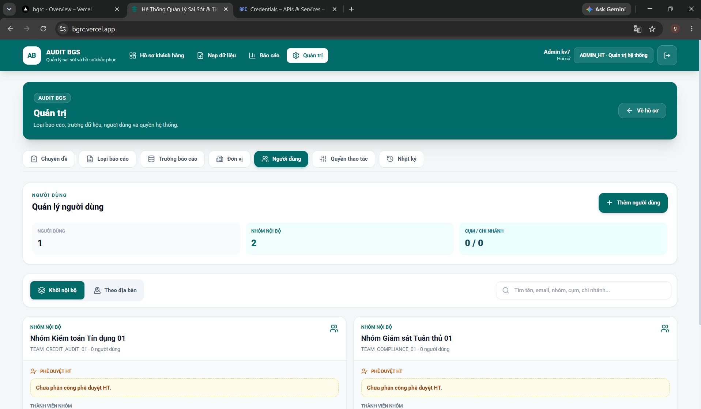

*Hình 1 - Quản trị người dùng theo nhóm nội bộ và phạm vi chi nhánh.*

## 4. Hướng dẫn sử dụng theo nghiệp vụ

### 4.1 Đăng nhập

1. Mở `https://bgrc.vercel.app`.
2. Chọn **Đăng nhập bằng Google**.
3. Chọn đúng email đã được Admin tạo trong AuditBGS.
4. Sau khi Google xác thực, hệ thống đối chiếu email với trường `email` hoặc `googleWorkspaceEmail` của tài khoản đang hoạt động.
5. Nếu email chưa được cấp quyền, hệ thống trả lỗi `GOOGLE_OIDC_USER_NOT_PROVISIONED`; Admin phải tạo user và gán vai trò trước.

Admin tạo user trong AuditBGS không tự thêm email vào danh sách **OAuth test users** của Google Cloud. Cách xử lý đúng:

- Nếu ứng dụng Google ở chế độ **Internal**: chỉ người trong Google Workspace của tổ chức dùng được; không cần thêm từng test user.
- Nếu ứng dụng ở chế độ **External - Testing**: phải thêm email thủ công tại Google Cloud - OAuth consent screen - Audience - Test users.
- Nếu ứng dụng ở chế độ **External - Production**: không dùng danh sách test users, nhưng scope Drive có thể cần quy trình xác minh của Google.

### 4.2 Danh sách hồ sơ khách hàng

1. Chọn chuyên đề ở thanh bên.
2. Lọc theo trạng thái, chi nhánh, cán bộ QLKH, mã lỗi hoặc SLA.
3. Dùng ô tìm kiếm theo CIF, tên khách hàng hoặc mã lỗi.
4. Màu tình trạng thể hiện mức độ khẩn cấp; đỏ đậm là quá hạn hoặc chậm trễ nghiêm trọng.
5. Mở hồ sơ để xem toàn bộ mã lỗi và lịch sử. Danh sách chỉ hiển thị một số mã đầu để tiết kiệm diện tích.

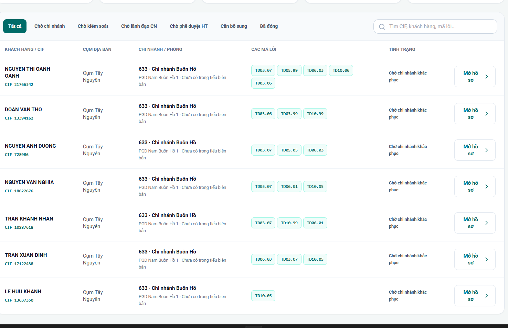

*Hình 2 - Danh sách hồ sơ dạng gọn; cụm địa bàn dùng để lọc nên không chiếm một cột hiển thị.*

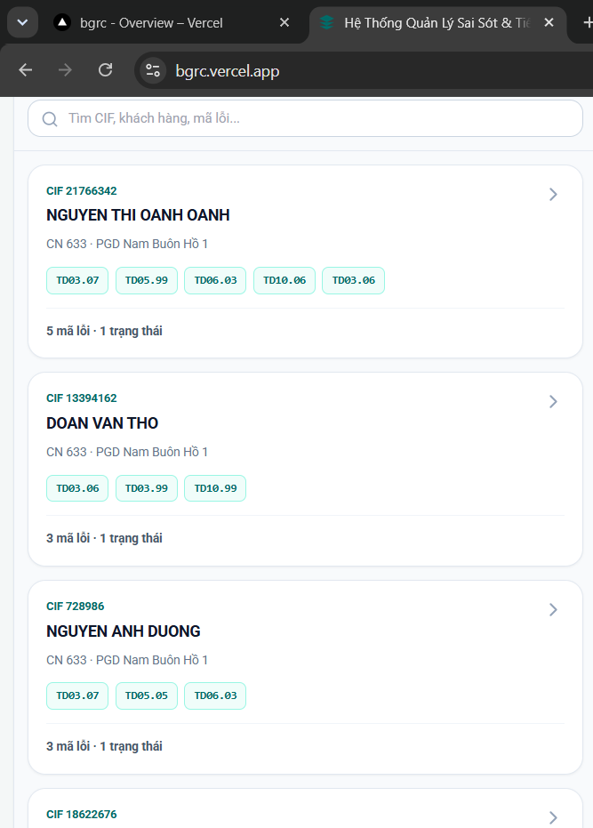

*Hình 3 - Giao diện mobile gom CIF, khách hàng, đơn vị, mã lỗi và trạng thái trong từng thẻ.*

### 4.2.1 Nhập dữ liệu sai sót

1. Vào **Nhập dữ liệu** và chọn bắt buộc **Loại báo cáo** rồi **Chuyên đề**. Hệ thống không cho chọn tệp trước khi xác định đúng hai đích này.
2. Chọn nguồn phù hợp:
   - **Nhiều file Excel** hoặc **Tệp ZIP** cho dữ liệu có cấu trúc;
   - **Dán từ Excel** cho vùng ô đã sao chép; các dòng trùng hoàn toàn theo chuyên đề, chi nhánh, CIF, mã lỗi và quyết định chỉ được ghi một lần;
   - **Tệp DOCX** khi tài liệu có bảng với các cột tối thiểu Họ tên khách hàng, CIF, Mã chi nhánh và Mã lỗi;
   - **Dữ liệu mẫu** chỉ dùng ở local/test.
3. Kiểm tra bản xem trước: tổng khách hàng, số mã lỗi, dòng trùng và dòng không hợp lệ. DOCX không đúng cấu trúc sẽ bị từ chối, không tự đoán nội dung văn xuôi.
4. Chỉ bấm **Nhập dữ liệu** sau khi đích và số liệu xem trước đúng. Mỗi lần commit có khóa chống xử lý lặp và ghi người nhập, thời điểm, nguồn, tên tệp, chuyên đề, loại báo cáo.
5. Nếu mạng gián đoạn, không tải lại tệp bằng một tab khác; chờ phản hồi hoặc kiểm tra danh sách hồ sơ để tránh thao tác song song.

Dữ liệu nhập từ Excel, ZIP, clipboard và DOCX đều đi qua cùng hợp đồng kiểm tra phía máy chủ. File Word chỉ hỗ trợ bảng sai sót có tiêu đề cột; PDF hiện dùng cho bóc tách bản nháp **chuyên đề**, không dùng để tự tạo sai sót khách hàng.

### 4.3 Chi nhánh khắc phục

1. Người có vai trò `BRANCH_INPUT` mở hồ sơ ở trạng thái **Chờ chi nhánh khắc phục** hoặc **Cần bổ sung**.
2. Chọn từng mã lỗi, nhập nội dung giải trình/biện pháp khắc phục.
3. Nếu loại báo cáo yêu cầu minh chứng, tải PDF, DOCX, XLSX, JPG hoặc PNG; tối đa 25 MB/tệp.
4. Chờ minh chứng chuyển sang trạng thái khả dụng.
5. Bấm **Nộp kiểm soát**. Hồ sơ được khóa sửa tài liệu cho tới khi bị trả lại.

### 4.4 Dấu sao - trường hợp đặc biệt

- Dấu sao nằm cạnh tên khách hàng trong chi tiết hồ sơ.
- Chỉ thay đổi trước khi hồ sơ rời bước chi nhánh.
- Không dấu sao, tuyến chuẩn là: **Chi nhánh -> Kiểm soát chi nhánh -> Hội sở**.
- Có dấu sao, tuyến là: **Chi nhánh -> Kiểm soát chi nhánh -> Lãnh đạo chi nhánh -> Hội sở**.
- Nếu loại báo cáo được cấu hình tuyến ba cấp thì bước Lãnh đạo chi nhánh vẫn bắt buộc dù người dùng không đánh dấu sao.
- Nếu loại báo cáo dùng luồng gọn một cấp thì hồ sơ có thể chuyển thẳng từ chi nhánh lên Hội sở theo cấu hình đã ghim.

### 4.5 Kiểm soát chi nhánh

1. Người có vai trò `BRANCH_CONTROLLER` mở nhóm **Chờ kiểm soát**.
2. Đối chiếu từng mã lỗi, giải trình và tài liệu.
3. Nếu chưa đạt, nhập lý do và chọn **Trả chi nhánh bổ sung**.
4. Nếu đạt, chọn **Chuyển duyệt**:
   - hồ sơ thường chuyển lên Hội sở;
   - hồ sơ có dấu sao chuyển sang Lãnh đạo chi nhánh.

### 4.6 Lãnh đạo chi nhánh

1. Người có vai trò `BRANCH_LEADER` mở nhóm **Chờ lãnh đạo CN**.
2. Kiểm tra hồ sơ đặc biệt và ý kiến kiểm soát.
3. Chọn **Duyệt** để chuyển Hội sở hoặc **Trả chi nhánh bổ sung** kèm lý do.

### 4.7 Phê duyệt Hội sở

1. Người có `SUPERVISOR` hoặc `INTERNAL_APPROVER` mở nhóm **Chờ phê duyệt HT**.
2. Kiểm tra nội dung, từng ý sai sót và minh chứng.
3. Nếu đạt, nhập thông tin quyết định/công văn cần thiết và đóng lỗi.
4. Nếu chưa đạt, trả lại chi nhánh. Khi nộp lại, hồ sơ đi lại đúng tuyến đã cấu hình.

### 4.8 Báo cáo

1. Vào **Báo cáo**, chọn mẫu đã lưu hoặc bắt đầu từ báo cáo tổng hợp.
2. Chọn trường nhóm, cột bảng chéo, chỉ số và trường lọc đã được Admin cho phép.
3. Có thể lọc theo chi nhánh, phòng/PGD, cán bộ QLKH, trạng thái, SLA, CIF, mã lỗi và chuyên đề.
4. Chuyển giữa **Bảng**, **Bảng chéo** và **Biểu đồ** (cột, đường hoặc tròn); số liệu luôn được tính lại trong phạm vi quyền của người đang xem.
5. Bấm **Lưu cách xem** để lưu mẫu cá nhân. Chọn một hoặc nhiều vai trò ở phần chia sẻ nếu cần cho những vai trò đó mở lại cùng mẫu; không chia sẻ quyền dữ liệu ngoài phạm vi của họ.
6. Chọn **Tạo dashboard**, đặt tên và chọn tối đa sáu mẫu báo cáo. Dashboard chạy từng widget bằng quyền của người mở dashboard, nên cùng một dashboard có thể cho số liệu khác nhau giữa các vai trò.
7. Khi muốn chỉnh sửa một mẫu dùng chung, bấm **Sao chép** rồi lưu bản sao; mẫu nguồn không bị thay đổi.
8. Xuất CSV, XLSX hoặc HTML tùy mẫu và quyền.

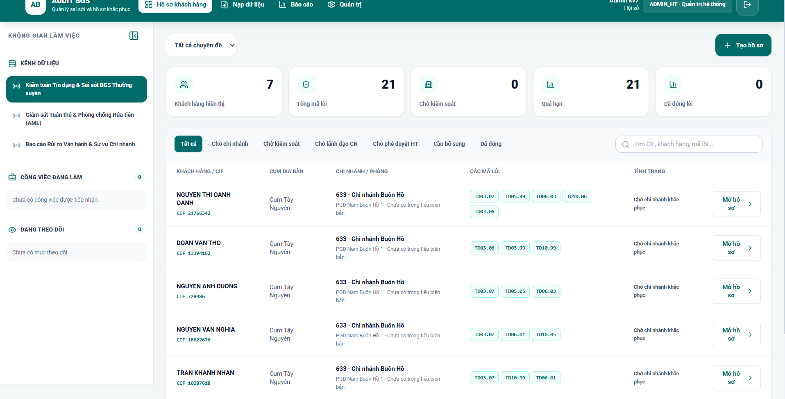

*Hình 4 - Không gian báo cáo và danh sách hồ sơ; bộ lọc được cấu hình theo từng trường.*

## 5. Hướng dẫn quản trị hệ thống

### 5.1 Tạo và quản lý cơ cấu tổ chức

Vào **Quản trị -> Đơn vị**:

1. Tạo nhóm nghiệp vụ nội bộ, cụm, chi nhánh và phòng/PGD theo đúng thứ tự cha-con.
2. Mã đơn vị phải duy nhất và ổn định.
3. Gán người phụ trách/phê duyệt ở đơn vị cần dùng.
4. Có thể sửa tên, mã, đơn vị cha, người phụ trách và trạng thái hoạt động.
5. Chỉ xóa khi không còn đơn vị con, người dùng, hồ sơ hoặc chuyên đề tham chiếu; nếu đã phát sinh dữ liệu thì nên tạm ngừng.

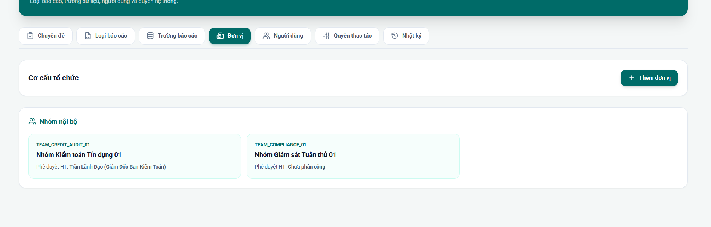

*Hình 5 - Nhóm nội bộ, cụm, chi nhánh và phòng/PGD đều có thao tác sửa/xóa có kiểm soát.*

### 5.2 Tạo người dùng

Vào **Quản trị -> Người dùng -> Thêm người dùng**:

1. Nhập họ tên, username và email Google chính xác.
2. Chọn cổng Nội bộ hoặc Chi nhánh.
3. Chọn vai trò chính và các vai trò bổ sung.
4. Với user chi nhánh, bắt buộc chọn chi nhánh/phòng phù hợp.
5. Với nhóm nội bộ, chọn nhóm và vai trò thành viên/phụ trách.
6. Bật trạng thái hoạt động và lưu.
7. Nếu production dùng OIDC, chính email vừa nhập là khóa đăng nhập; mật khẩu nội bộ không được dùng ở `AUTH_MODE=oidc`.

Để tạo theo lô, chọn **Tải mẫu Excel** rồi điền sheet `NGUOI_DUNG`:

1. Không đổi tên sheet hoặc hàng tiêu đề đầu tiên.
2. Các cột bắt buộc là Họ và tên, Email, Cổng và Vai trò chính; dùng danh sách chọn có sẵn cho Cổng, Vai trò và Trạng thái.
3. User chi nhánh phải có Mã chi nhánh và Phòng/PGD hợp lệ; cán bộ nội bộ phải có Mã đơn vị/nhóm nội bộ phù hợp.
4. Mật khẩu tạm có thể để trống để hệ thống tự sinh. Sau khi commit, danh sách credential được tải đúng một lần; bảo quản an toàn và xóa sau khi bàn giao.
5. Mở **Nhập danh sách Excel**, sửa các dòng báo lỗi trong bản xem trước rồi chọn **Tạo tài khoản hợp lệ**. Máy chủ xử lý một lô có `Idempotency-Key`; lỗi một dòng được trả đúng dòng và không tạo trùng các dòng đã thành công.
6. Việc thêm email vào Google OAuth/test user/domain vẫn là thao tác thủ công trên Google Cloud; nhập user trong AuditBGS không tự thay đổi cấu hình Google.

Để tạo sáu user thử nghiệm ở local/test:

```powershell
$env:ADMIN_USERNAME = 'quantri'
$env:ADMIN_PASSWORD = '<mat-khau-admin>'
npm run users:seed-test -- --password '<mat-khau-chung-tu-12-ky-tu>'
```

Script từ chối chạy khi `NODE_ENV=production`.

### 5.3 Tạo chuyên đề thủ công hoặc từ tài liệu

Vào **Quản trị -> Chuyên đề**:

1. Chọn **Tạo chuyên đề** để nhập mã, tên, quyết định, thời gian, trưởng đoàn, thành viên, chi nhánh và loại báo cáo.
2. Hoặc chọn **Nhập DOCX, PDF hoặc Excel** để hệ thống bóc tách bản nháp.
3. Kiểm tra các trường hệ thống trích xuất; bổ sung trường còn thiếu trước khi lưu.
4. Chuyên đề nháp có thể sửa hoặc xóa. Chuyên đề đã có hồ sơ chỉ nên chuyển trạng thái/archived, không xóa dữ liệu lịch sử.
5. Sau khi Google Drive sẵn sàng, chọn **Tạo kho dữ liệu Drive**; khi cần cập nhật quyền/thư mục, chọn **Đồng bộ Drive**.

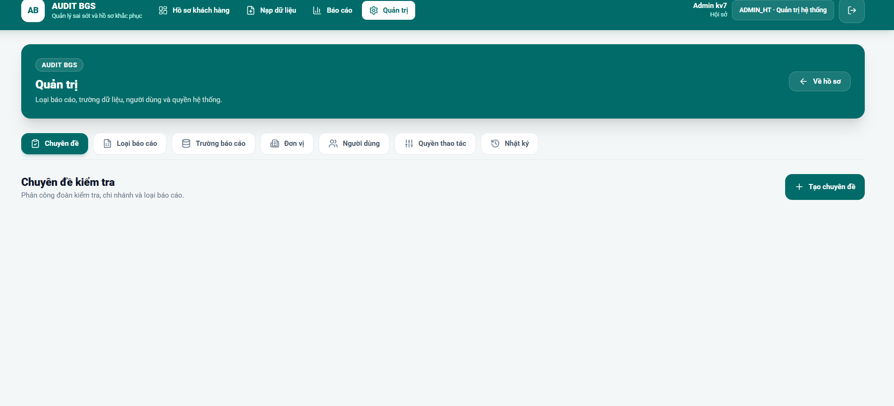

*Hình 6 - Quản trị chuyên đề hỗ trợ tạo, sửa, xóa nháp và bóc tách DOCX/PDF/Excel.*

### 5.4 Cấu hình loại báo cáo, form và workflow

Vào **Quản trị -> Loại báo cáo**:

1. Khai báo mã, tên, đơn vị chủ quản và kênh nhập.
2. Thiết kế form theo block và trường dữ liệu.
3. Chọn trường bắt buộc, kiểu dữ liệu và dropdown.
4. Cấu hình có/không yêu cầu minh chứng.
5. Chọn luồng duyệt. Luồng mới chỉ áp dụng cho hồ sơ tạo sau khi lưu phiên bản; hồ sơ cũ giữ phiên bản đã ghim.
6. Cấu hình SLA, thông báo và tích hợp.
7. Lưu phiên bản mới, kiểm tra trên hồ sơ mẫu rồi mới kích hoạt rộng.

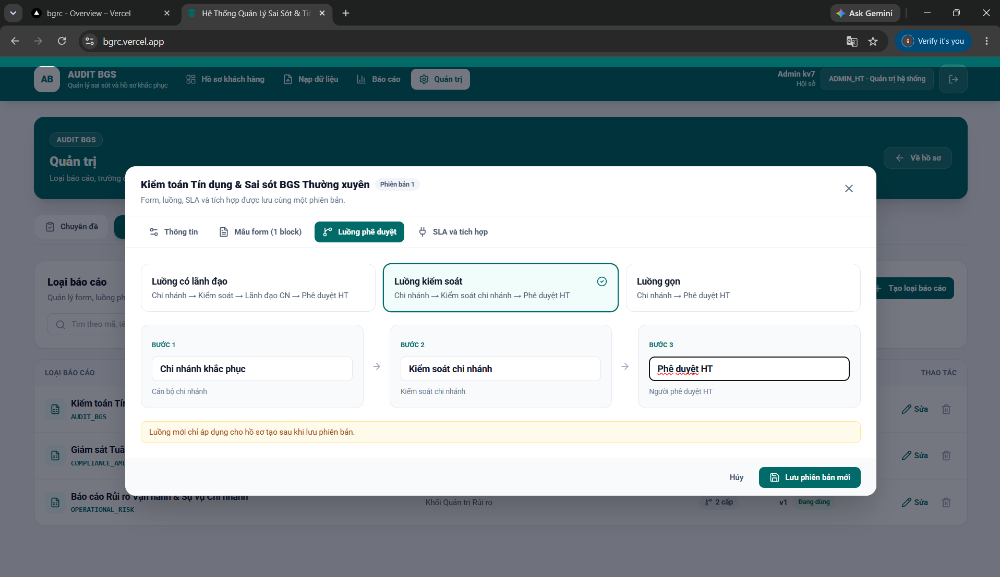

*Hình 7 - Luồng phê duyệt được cấu hình ở loại báo cáo; người dùng hồ sơ không chọn tay người/tuyến duyệt.*

### 5.5 Cấu hình trường báo cáo

Vào **Quản trị -> Trường báo cáo**:

- **Hiển thị**: trường xuất hiện trong danh mục báo cáo.
- **Cho phép lọc**: người dùng được chọn trường đó làm điều kiện lọc.
- **Xuất mặc định**: trường tự có trong file xuất.
- Có thể đổi tên hiển thị và sắp xếp thứ tự.
- Tắt hiển thị sẽ đồng thời loại trường khỏi lọc/xuất mặc định để tránh cấu hình mâu thuẫn.

### 5.6 Nhật ký xử lý

Vào **Quản trị -> Nhật ký**:

- Tìm theo sự kiện, người thao tác, CIF hoặc mã lỗi.
- Chọn **Tải CSV** để lưu bằng chứng kiểm toán.
- Nút xóa chỉ dùng cho dữ liệu thử nghiệm local/test; production giữ nhật ký và API từ chối xóa.

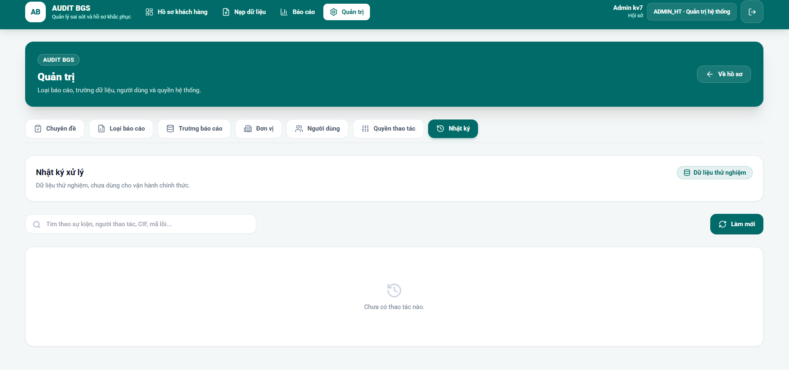

*Hình 8 - Nhật ký cho phép tìm, làm mới và xuất dữ liệu; xóa được giới hạn theo môi trường.*

## 6. Cài đặt chạy local trên Windows

### 6.1 Yêu cầu

- Windows 10/11, PowerShell 7 khuyến nghị.
- Node.js 20 LTS trở lên và npm.
- PostgreSQL chỉ cần khi kiểm thử chế độ database thật; mặc định local dùng JSON.

### 6.2 Cài mã nguồn

```powershell
git clone https://github.com/Kiemtra07/BGRC.git E:\AuditBGS
Set-Location E:\AuditBGS
npm install
Copy-Item .env.example .env.local
```

Không commit `.env`, `.env.local`, khóa Google, mật khẩu, refresh token hoặc database URL.

### 6.3 Cấu hình local tối thiểu

```dotenv
NODE_ENV=development
PORT=3001
AUTH_MODE=mock-header
DATA_STORE_MODE=local-json
LOCAL_STATE_FILE=./data/local-state.json
EVIDENCE_STORAGE_MODE=local
LOCAL_EVIDENCE_DIR=./data/drive_storage
CORS_ALLOWED_ORIGINS=http://localhost:3000,http://127.0.0.1:3000
VITE_API_BASE_URL=/api
SEED_DEMO_DATA=true
```

### 6.4 Chạy và kiểm tra

Mở hai cửa sổ PowerShell:

```powershell
npm run dev:api
```

```powershell
npm run dev:web
```

Truy cập `http://localhost:3000`. API mặc định ở `http://localhost:3001`.

Trước khi bàn giao thay đổi:

```powershell
npm run db:migrate:dry-run
npm run typecheck
npm run test:unit
npm run test:integration
npm run test:contract
npm run build
```

## 7. Cài đặt production trên Supabase và Vercel

### 7.1 Tạo database Supabase

1. Tạo project Supabase ở region gần người dùng, ví dụ Singapore.
2. Vào **Connect** và lấy **Shared Pooler - Transaction mode**, cổng `6543` cho Vercel serverless.
3. Nếu mật khẩu có ký tự đặc biệt, percent-encode trong URL.
4. Bổ sung `?sslmode=require` nếu chuỗi được cấp chưa có.
5. Chạy dry-run rồi migration từ máy quản trị an toàn:

```powershell
$env:DATABASE_URL = 'postgresql://postgres.<project-ref>:<password-encoded>@aws-0-<region>.pooler.supabase.com:6543/postgres?sslmode=require'
npm run db:migrate:dry-run
npm run db:migrate
```

Không dùng publishable/anon key làm `DATABASE_URL`; ứng dụng hiện kết nối PostgreSQL bằng connection string phía server.

### 7.2 Cấu hình Vercel

1. Import repo `Kiemtra07/BGRC` vào Vercel.
2. Production branch là `main`; framework/build lấy từ `vercel.json` và `package.json`.
3. Vào **Project Settings -> Environments -> Production -> Environment Variables**.
4. Biến nhạy cảm chọn loại **Secret**.
5. Sau khi thêm/sửa biến, bắt buộc **Redeploy**; biến mới không áp dụng ngược cho deployment cũ.

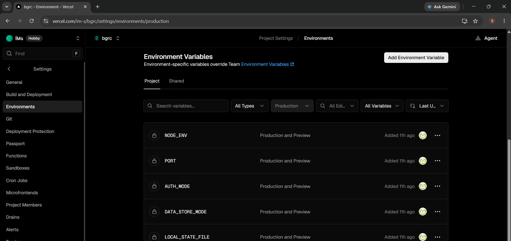

*Hình 9 - Chọn môi trường Production và kiểm tra đủ biến trước khi redeploy.*

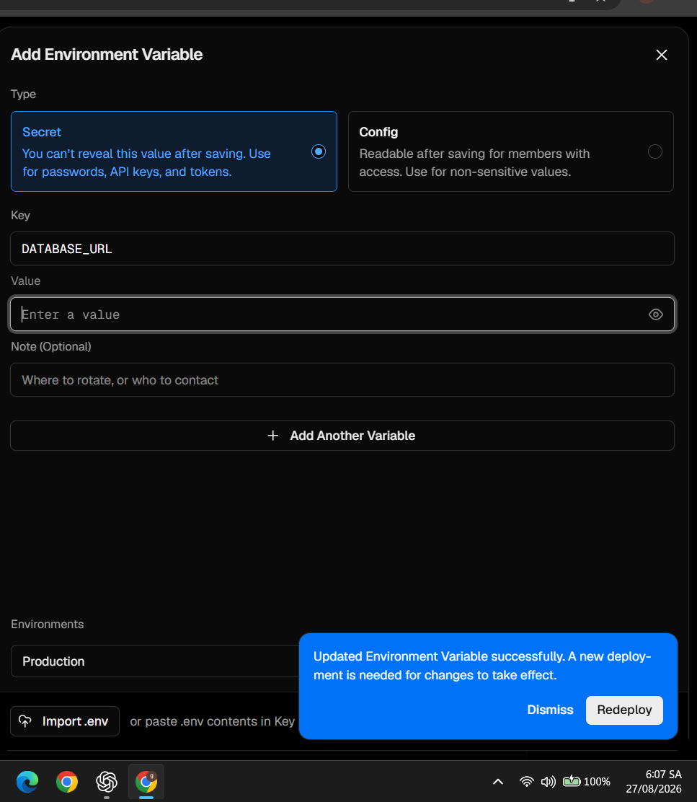

*Hình 10 - Nhập value đầy đủ; không để dấu nháy bao quanh và không thêm khoảng trắng đầu/cuối.*

### 7.3 Bộ biến production bắt buộc

```dotenv
NODE_ENV=production
DATA_STORE_MODE=postgres
DATABASE_URL=postgresql://postgres.<project-ref>:<password>@aws-0-<region>.pooler.supabase.com:6543/postgres?sslmode=require
CORS_ALLOWED_ORIGINS=https://bgrc.vercel.app
VITE_API_BASE_URL=/api

AUTH_MODE=oidc
OIDC_ISSUER_URL=https://accounts.google.com
OIDC_AUDIENCE=<GOOGLE_WEB_CLIENT_ID>
GOOGLE_OIDC_CLIENT_ID=<GOOGLE_WEB_CLIENT_ID>
GOOGLE_OIDC_CLIENT_SECRET=<GOOGLE_WEB_CLIENT_SECRET>
GOOGLE_OIDC_REDIRECT_URI=https://bgrc.vercel.app/api/v1/auth/google/callback
GOOGLE_OIDC_STATE_SECRET=<64-hex-or-strong-random>

EVIDENCE_STORAGE_MODE=google-drive
GOOGLE_DRIVE_AUTH_MODE=oauth-user
GOOGLE_OAUTH_CLIENT_ID=<GOOGLE_WEB_CLIENT_ID>
GOOGLE_OAUTH_CLIENT_SECRET=<GOOGLE_WEB_CLIENT_SECRET>
GOOGLE_OAUTH_REDIRECT_URI=https://bgrc.vercel.app/api/v1/integrations/google-drive/callback
GOOGLE_OAUTH_STATE_SECRET=<64-hex-or-strong-random>
GOOGLE_OAUTH_TOKEN_ENCRYPTION_KEY=<64-hex>
GOOGLE_DRIVE_ROOT_FOLDER_ID=<folder-id>

CRON_SECRET=<64-hex-or-strong-random>
SEED_DEMO_DATA=false
SEED_DEMO_USERS=false
BOOTSTRAP_ADMIN_USERNAME=<admin-username>
BOOTSTRAP_ADMIN_PASSWORD_HASH=<scrypt-hash>
BOOTSTRAP_ADMIN_EMAIL=<admin-google-email>
BOOTSTRAP_ADMIN_FULLNAME=<ho-ten-admin>
```

Sinh khóa và hash trên PowerShell:

```powershell
node -e "console.log(require('crypto').randomBytes(32).toString('hex'))"
npm run auth:hash-password -- '<mat-khau-manh>'
```

Mỗi secret nên sinh riêng. Không dùng lại `CRON_SECRET` cho state hoặc mã hóa token.

## 8. Cấu hình Google OIDC và Google Drive cá nhân

### 8.1 Vì sao có hai luồng Google

| Mục đích | Scope | Callback production |
|---|---|---|
| Đăng nhập AuditBGS | `openid email profile` | `https://bgrc.vercel.app/api/v1/auth/google/callback` |
| Lưu minh chứng vào Drive cá nhân | Google Drive | `https://bgrc.vercel.app/api/v1/integrations/google-drive/callback` |

Có thể dùng cùng một OAuth Web Client, nhưng phải khai báo đủ cả hai redirect URI.

### 8.2 Tạo project và bật API

1. Mở Google Cloud Console và tạo/chọn project.
2. Vào **APIs & Services -> Library**.
3. Tìm **Google Drive API** và chọn **Enable**.
4. Vào **Google Auth Platform -> Branding**, nhập tên ứng dụng, email hỗ trợ và thông tin liên hệ.
5. Vào **Audience**:
   - tài khoản Gmail cá nhân: chọn **External**;
   - tài khoản Google Workspace cùng tổ chức: có thể chọn **Internal**.
6. Nếu External đang **Testing**, thêm email admin vào **Test users**.
7. Vào **Data Access/Scopes**, khai báo scope Drive mà ứng dụng yêu cầu. Mã nguồn hiện dùng `https://www.googleapis.com/auth/drive`.

Ứng dụng External ở trạng thái Testing giới hạn tối đa 100 test users. Với scope ngoài đăng nhập cơ bản, refresh token của test user có thể hết hạn sau 7 ngày; để vận hành ổn định cần đưa ứng dụng sang Production và hoàn tất xác minh nếu Google yêu cầu.

### 8.3 Tạo OAuth Web Client

1. Vào **Google Auth Platform -> Clients -> Create Client**.
2. Chọn loại **Web application**.
3. Thêm **Authorized JavaScript origins**:

```text
https://bgrc.vercel.app
http://localhost:3000
```

4. Thêm **Authorized redirect URIs** chính xác:

```text
https://bgrc.vercel.app/api/v1/auth/google/callback
https://bgrc.vercel.app/api/v1/integrations/google-drive/callback
http://localhost:3001/api/v1/auth/google/callback
http://localhost:3001/api/v1/integrations/google-drive/callback
```

5. Lưu và lấy Client ID/Client Secret. Không đưa Client Secret vào biến `VITE_*`.

Google so khớp redirect URI tuyệt đối, gồm protocol, domain, port, path và dấu `/`. Nếu báo `redirect_uri_mismatch`, mở URL yêu cầu lỗi, xem giá trị `redirect_uri`, rồi sao chép đúng giá trị đó vào OAuth Web Client.

### 8.4 Chuẩn bị thư mục Drive cá nhân

1. Trong My Drive, tạo thư mục gốc, ví dụ `VaultKTGS`.
2. Mở thư mục và lấy ID ở URL:

```text
https://drive.google.com/drive/folders/1AbCdEf...
                                       ^^^^^^^^^ ID thư mục
```

3. Đặt ID đó vào `GOOGLE_DRIVE_ROOT_FOLDER_ID`.
4. Khi dùng OAuth cá nhân, không cần share thư mục cho service account; tài khoản Google thực hiện kết nối phải có quyền chỉnh sửa thư mục.

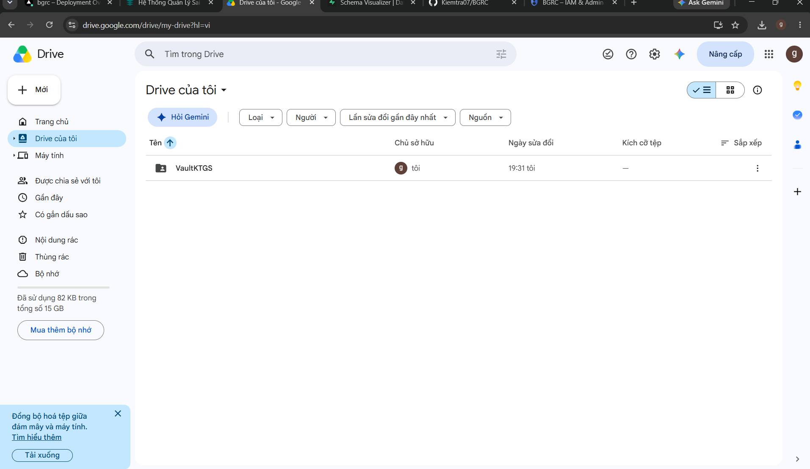

*Hình 11 - Thư mục My Drive có thể dùng với `GOOGLE_DRIVE_AUTH_MODE=oauth-user`.*

Service account không phù hợp với thư mục My Drive cá nhân trong cấu hình hiện tại. Adapter yêu cầu thư mục service account nằm trong **Shared Drive** và được cấp Contributor hoặc Content Manager. Muốn dùng My Drive cá nhân, chọn OAuth user.

### 8.5 Kết nối Drive sau khi deploy

1. Điền đủ biến `GOOGLE_OAUTH_*`, `GOOGLE_DRIVE_ROOT_FOLDER_ID` và redeploy.
2. Đăng nhập AuditBGS bằng tài khoản Admin.
3. Trong cùng trình duyệt/phiên đăng nhập, mở:

```text
https://bgrc.vercel.app/api/v1/integrations/google-drive/connect
```

4. Chọn tài khoản Google sở hữu/có quyền chỉnh sửa thư mục gốc.
5. Chấp thuận quyền Drive.
6. Khi thấy thông báo **Đã kết nối Google Drive cá nhân**, đóng tab và quay lại AuditBGS.
7. Kiểm tra `GET /api/v1/ready`; Drive phải ở trạng thái sẵn sàng.
8. Tạo chuyên đề thử, chọn **Tạo kho dữ liệu Drive**, sau đó tải một tệp minh chứng thử nghiệm.

Callback Drive yêu cầu đúng phiên Admin đã bắt đầu kết nối; không mở callback ở trình duyệt khác hoặc tab ẩn danh.

### 8.6 Khi không nhận được refresh token

Nếu xuất hiện `GOOGLE_OAUTH_REFRESH_TOKEN_MISSING`:

1. Mở Google Account -> Security -> Third-party apps & services.
2. Thu hồi quyền của ứng dụng AuditBGS.
3. Đăng nhập lại AuditBGS và mở lại endpoint `/api/v1/integrations/google-drive/connect`.
4. Chấp thuận lại để Google cấp refresh token mới.

## 9. Nghiệm thu sau triển khai

Thực hiện lần lượt:

1. `GET https://bgrc.vercel.app/api/v1/health` trả HTTP 200.
2. `GET https://bgrc.vercel.app/api/v1/ready` trả `ready: true`; data store durable và Drive available.
3. Đăng nhập bằng email `BOOTSTRAP_ADMIN_EMAIL`.
4. Admin tạo một user chi nhánh, một kiểm soát, một lãnh đạo và một người duyệt Hội sở.
5. Tạo chuyên đề và kho Drive.
6. Tạo/nạp hồ sơ thường; kiểm tra tuyến Chi nhánh -> Kiểm soát -> Hội sở.
7. Tạo hồ sơ có dấu sao; kiểm tra tuyến có thêm Lãnh đạo chi nhánh.
8. Upload tệp lớn hơn 5 MB; kiểm tra tải trực tiếp lên Drive và mở lại được.
9. Chạy báo cáo với bộ lọc chi nhánh/cán bộ/trạng thái và xuất XLSX.
10. Tải CSV nhật ký; xác nhận đủ người, thời điểm và hành động.

## 10. Lịch vận hành

### Hằng ngày

- Kiểm tra `/api/v1/ready`, Vercel runtime logs và trạng thái Supabase.
- Kiểm tra hàng đợi quá hạn, cron SLA và lỗi upload Drive.
- Xem audit log cho đăng nhập thất bại hoặc thao tác bất thường.

### Hằng tuần

- Xuất nhật ký kiểm toán lưu trữ riêng.
- Kiểm tra user nghỉ/chuyển vị trí và khóa tài khoản không còn dùng.
- Kiểm tra dung lượng Drive và quyền thư mục chuyên đề.
- Kiểm tra email cảnh báo Supabase/Vercel/Google.

### Hằng tháng

- Rà soát vai trò và phạm vi theo nguyên tắc quyền tối thiểu.
- Kiểm tra backup/restore Supabase và thử phục hồi trên môi trường test.
- Xoay vòng secret theo chính sách; mỗi lần đổi env phải redeploy.
- Rà soát các loại báo cáo, SLA, workflow và phiên bản đang dùng.

## 11. Supabase Free và cơ chế chống pause

Supabase có thể tự pause project Free khi hoạt động database quá thấp trong khoảng bảy ngày. AuditBGS đã cấu hình một Vercel Cron hằng ngày tại `30 1 * * *` (08:30 Việt Nam) để đánh giá SLA và thực hiện truy vấn/giao dịch PostgreSQL thật. Đây là hoạt động có ích, không tạo dữ liệu rác.

Tuy nhiên, cron không phải cam kết rằng project Free sẽ không bao giờ pause. Supabase nêu rằng một vài truy vấn người dùng mỗi ngày thường đủ để duy trì hoạt động, nhưng chỉ gói trả phí mới loại trừ hoàn toàn cơ chế automatic pausing.

Khi project bị pause:

1. Mở Supabase Dashboard.
2. Chọn project và bấm **Resume project**.
3. Chờ database khởi động.
4. Kiểm tra `/api/v1/ready`, login, tạo/đọc hồ sơ và cron.

## 12. Xử lý sự cố nhanh

| Hiện tượng | Nguyên nhân thường gặp | Cách xử lý |
|---|---|---|
| `redirect_uri_mismatch` | Callback trên Google không khớp env | Thêm đúng cả hai callback production, lưu, chờ vài phút rồi thử lại |
| `GOOGLE_OIDC_USER_NOT_PROVISIONED` | Email Google chưa có user AuditBGS | Admin tạo user, nhập đúng email và bật hoạt động |
| `GOOGLE_OAUTH_REFRESH_TOKEN_MISSING` | Google không cấp token dài hạn | Thu hồi quyền ứng dụng rồi kết nối Drive lại |
| Drive chưa sẵn sàng | Thiếu env, sai folder ID hoặc tài khoản không có quyền | Kiểm `GOOGLE_OAUTH_*`, root folder và `/api/v1/ready`; redeploy sau khi sửa env |
| Build Vercel không nhận env mới | Env chỉ áp dụng cho deployment mới | Redeploy production |
| Database lỗi kết nối | Dùng URL trực tiếp/port sai hoặc mật khẩu chưa encode | Lấy Shared Pooler transaction port 6543 và percent-encode mật khẩu |
| Không thấy hồ sơ | Sai phạm vi dữ liệu/chi nhánh/chuyên đề | Admin kiểm vai trò, branchCode, department và trạng thái user |
| Không xóa chuyên đề/đơn vị | Đang có dữ liệu tham chiếu | Chuyển tạm ngừng/archived thay vì xóa lịch sử |
| Hồ sơ không đi qua lãnh đạo CN | Hồ sơ không có dấu sao hoặc loại báo cáo không bắt buộc | Kiểm `isSpecialCase` trước khi nộp và phiên bản luồng đã ghim |
| SLA không cập nhật | Cron không chạy hoặc `CRON_SECRET` sai | Kiểm Vercel Cron/log và gọi endpoint nội bộ bằng secret từ môi trường an toàn |

## 13. Bảo mật và thay đổi cấu hình

- Không gửi token, database URL, service account JSON hoặc client secret qua chat/tài liệu.
- Nếu secret đã lộ, thu hồi/xoay vòng ngay; cập nhật Vercel và redeploy.
- Không đặt secret trong biến có tiền tố `VITE_` vì chúng có thể được đưa vào bundle trình duyệt.
- Không bật `SEED_DEMO_DATA` hoặc `SEED_DEMO_USERS` ở production.
- Không xóa nhật ký production.
- Không dùng tài khoản Google cá nhân của nhân sự sắp nghỉ làm chủ kho Drive lâu dài; nên dùng tài khoản vận hành được tổ chức quản lý.
- Trước khi đổi luồng/field/SLA, tạo phiên bản mới và nghiệm thu bằng hồ sơ thử.

## 14. Nguồn tham chiếu chính thức

- Google OAuth 2.0 Web Server: <https://developers.google.com/identity/protocols/oauth2/web-server>
- Google OpenID Connect: <https://developers.google.com/identity/openid-connect/openid-connect>
- Google Drive API scopes: <https://developers.google.com/workspace/drive/api/guides/api-specific-auth>
- Google Cloud App Audience/Test users: <https://support.google.com/cloud/answer/15549945>
- Vercel Environment Variables: <https://vercel.com/docs/environment-variables>
- Supabase kết nối PostgreSQL: <https://supabase.com/docs/guides/database/connecting-to-postgres>
- Supabase Project Pausing: <https://supabase.com/docs/guides/platform/free-project-pausing>

## 15. Checklist bàn giao cho quản trị viên

- [ ] Đã lưu Client ID/Secret và các secret trong kho bí mật nội bộ.
- [ ] Đã khai báo đủ hai redirect URI production.
- [ ] Đã bật Google Drive API và cấu hình Audience/Scopes.
- [ ] Đã nối Drive bằng đúng tài khoản sở hữu thư mục gốc.
- [ ] Đã dùng Supabase Shared Pooler transaction port 6543.
- [ ] Đã chạy migration và kiểm `/api/v1/ready`.
- [ ] Đã tạo Admin và các user nghiệp vụ bằng email thật.
- [ ] Đã nghiệm thu hai luồng thường/đặc biệt.
- [ ] Đã thử upload/download minh chứng và xuất báo cáo.
- [ ] Đã kiểm Vercel Cron và nhật ký.
- [ ] Đã thống nhất lịch backup, xoay secret và rà soát quyền.
