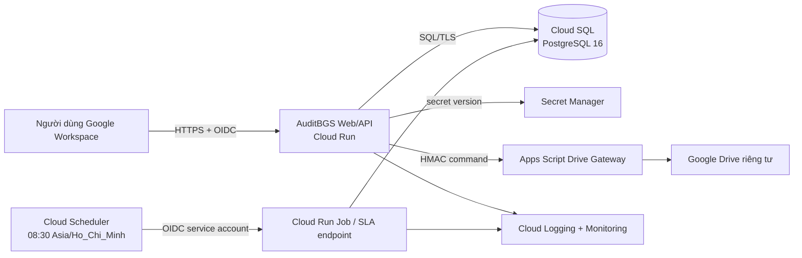

# ADR-001: Triển khai AuditBGS trên Google Cloud

## Trạng thái

Chấp thuận về kiến trúc mục tiêu; chưa được phép triển khai production cho đến khi hoàn tất các cổng P0 trong tài liệu này.

## Bối cảnh

AuditBGS gồm frontend React/Vite, API Fastify, xử lý SLA theo lịch, dữ liệu nghiệp vụ có quan hệ và kho chứng từ Google Drive. Hệ thống phục vụ dữ liệu kiểm tra nội bộ nên cần phân quyền theo phạm vi, nhật ký bất biến, sao lưu, khôi phục và khả năng thu hồi phiên bản.

Hiện tại API vẫn đọc/ghi `data/local-state.json`; PostgreSQL mới được dùng cho migration/seed. Đăng nhập production OIDC và adapter Google Drive API v3 cho tệp minh chứng chưa hoàn tất. Vì vậy bản hiện tại chỉ phù hợp local/UAT có kiểm soát.

## Các phương án đã xem xét

| Phương án | Ưu điểm | Hạn chế | Kết luận |
|---|---|---|---|
| Vercel + database ngoài | Frontend nhanh, thao tác đơn giản | Không phù hợp worker dài hạn và filesystem; chia nhiều nhà cung cấp | Không chọn làm nền tảng chính |
| Render/Railway + PostgreSQL | Dễ dựng UAT, ít thao tác hạ tầng | Identity, Drive, secrets và kiểm soát tổ chức nằm rải rác | Có thể dùng cho demo/UAT ngắn hạn |
| VPS + Docker + PostgreSQL | Toàn quyền, chi phí ban đầu dễ dự tính | Tự vá lỗi, backup, HA, giám sát và vận hành | Không chọn cho nhóm nhỏ |
| Google Cloud Run + Cloud SQL | Container quản trị, kết nối Cloud SQL, Scheduler, Secret Manager, IAP/OIDC và Drive cùng hệ sinh thái | Cần thiết lập IAM, billing và kiểm soát chi phí | **Chọn** |

## Quyết định

- Khu vực mặc định: `asia-southeast1` (Singapore) cho Cloud Run và Cloud SQL.
- Runtime: Cloud Run cho web/API; Cloud Run Job hoặc endpoint nội bộ được Cloud Scheduler gọi cho SLA 08:30 `Asia/Ho_Chi_Minh`.
- Database: Cloud SQL for PostgreSQL 16. UAT dùng single-zone; production dùng HA, automated backups và PITR.
- Identity: Google Workspace OIDC theo server flow; giới hạn domain và ánh xạ email sang user/role/scope trong PostgreSQL. Có thể bật IAP làm lớp bảo vệ ngoài.
- Secrets: Secret Manager; không đặt secret trong source, image hoặc biến `VITE_*`.
- Tệp minh chứng: thư mục Google Drive chung do tài khoản quản trị sở hữu; backend/Apps Script cấp ACL theo chuyên đề. Không dùng filesystem Cloud Run làm kho bền vững.
- Mọi migration chạy bằng job một lần trước khi chuyển traffic; không chạy migration đồng thời ở nhiều web instance.

## Sơ đồ mục tiêu

## Hệ quả và đánh đổi

- Có một nền tảng thống nhất cho runtime, database, lịch chạy, secrets và quan sát hệ thống.
- Phải hoàn tất repository PostgreSQL, OIDC, outbox/email và Drive binary trước production.
- Cloud Run có thể mở nhiều instance; mọi session, idempotency, audit event và state phải nằm trong PostgreSQL, không nằm trong RAM hoặc JSON local.
- Pool hiện tại `max=20` phải được tính cùng `max-instances`; ví dụ 5 instance là tối đa khoảng 100 kết nối ứng dụng trước khi tính job/migration.

## Điều kiện xem xét lại

- Chính sách ngân hàng bắt buộc triển khai on-premise hoặc private cloud.
- Dữ liệu bắt buộc lưu tại Việt Nam và Singapore không được chấp nhận.
- Tải ổn định cao khiến Cloud Run không còn hiệu quả chi phí.
- Tổ chức đã chuẩn hóa toàn bộ hạ tầng trên Azure/AWS và không cho phép GCP.

## Tài liệu chính thức

- [Cloud Run deployment](https://docs.cloud.google.com/run/docs/deploying)
- [Cloud Run locations](https://docs.cloud.google.com/run/docs/locations)
- [Cloud Run kết nối Cloud SQL PostgreSQL](https://docs.cloud.google.com/sql/docs/postgres/connect-run)
- [Cloud Scheduler gọi HTTP có xác thực](https://docs.cloud.google.com/scheduler/docs/http-target-auth)
- [Cloud Run và Secret Manager](https://docs.cloud.google.com/run/docs/configuring/services/secrets)
- [Cloud SQL backup, PITR và HA](https://docs.cloud.google.com/sql/docs/postgres/backup-recovery/backup-options)
- [Google OpenID Connect](https://developers.google.com/identity/openid-connect/openid-connect)

