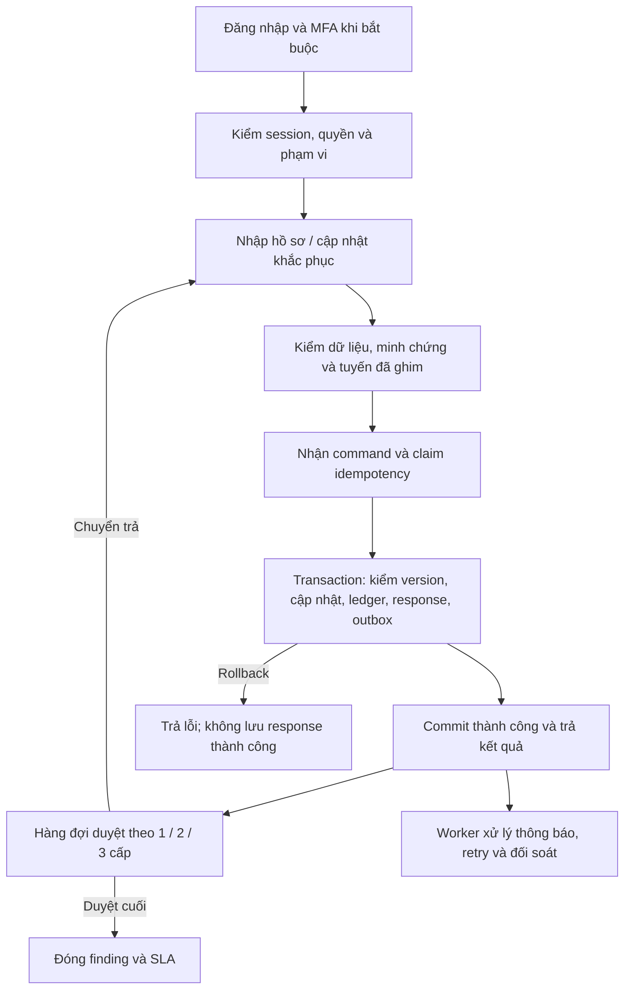

# Kế hoạch nâng cấp và tối ưu AuditBGS

Ngày đánh giá: **05/09/2026** · Mã nguồn đối chiếu: **dcc5114c2b02da0cafeec8f6b51cd98d6cbd5eea**.

## 1. Kết luận và phạm vi bằng chứng

Dự án đã có nền tảng nghiệp vụ và bảo mật đáng kể. Ưu tiên tiếp theo là bảo đảm **một thao tác chỉ được xác nhận khi dữ liệu, lịch sử và kết quả chống gửi lặp đã lưu thành công**, rồi củng cố MFA, phân quyền và vận hành nhiều instance. Chưa nên mở rộng tải chỉ dựa vào test hiện có.

Đánh giá này đọc mã nguồn backend, frontend, contracts, migrations và test; chạy **10 file / 77 test, tất cả PASS**, thời gian Vitest **18,37 giây**. Có probe TOTP tại máy local. Chưa chạy full CI, trình duyệt E2E, kiểm thử PostgreSQL thật nhiều instance, kiểm tra quyền Drive thật, backup/restore hoặc kiểm chứng production trong phiên này. Không sử dụng trạng thái triển khai trong tài liệu cũ làm bằng chứng hiện tại.

Các điểm đã có cần giữ: email/mật khẩu; session cookie HttpOnly/SameSite/Secure khi production và token digest; scrypt; MFA với secret mã hóa AES-GCM; RBAC và bộ lọc scope dùng chung; `expectedVersion`; claim idempotency; snapshot + workflow ledger cùng transaction; security ledger riêng; proxy minh chứng kiểm quyền; CSP/no-store/nosniff; SQL có lọc scope, đếm và phân trang; bootstrap và lazy loading. Không lập lại các hạng mục này như thể chưa tồn tại.

## 2. Phát hiện ưu tiên

**P0:** cần xử lý trước đợt mở rộng sử dụng; **P1:** hoàn thiện ngay sau P0; **P2:** tối ưu theo số đo. “Tĩnh” là kết luận từ mã nguồn, chưa phải lỗi đã tái hiện trên production.

| Mã | Mức | Bằng chứng hiện tại | Tác động và hướng xử lý |
|---|---|---|---|
| F01 | P0 | **Tĩnh:** `server/src/app.ts:5221` gọi `rememberIdempotentResponse` trước `persistLocalState`; `server/src/repositories/idempotency-store.ts:183` hoàn tất response bằng transaction riêng. | Nếu bước lưu snapshot/ledger sau đó thất bại, response thành công có thể vẫn được phát lại dù nghiệp vụ chưa commit. Gộp việc hoàn tất idempotency vào transaction nghiệp vụ; không chỉ đảo thứ tự hai lời gọi. |
| F02 | P0 | **Tĩnh:** `server/src/app.ts:1787` đồng bộ `finding_records` sau commit, lỗi chỉ cảnh báo; `server/src/repositories/finding-records.ts:119` đồng bộ từ toàn bộ snapshot, upsert không có điều kiện chống bản cũ ghi đè bản mới. | Hai instance hoàn tất projection ngược thứ tự có thể làm lùi dữ liệu đọc, kể cả cột phạm vi; lỗi projection có thể kéo dài tới lần ghi sau. Cần thứ tự phiên bản bền vững và cơ chế sửa lệch độc lập. Chưa tái hiện rò dữ liệu thực tế. |
| F03 | P0 | **Probe local:** cùng OTP cho kết quả `true` hai lần ở `verifyTotpCode`; `server/src/app.ts:3198` không ghi nhận time-step đã dùng, nhánh OTP sai không tăng bộ đếm sai mật khẩu. Burst limit tại `app.ts:2130` là bộ đếm RAM chung mỗi instance. | Thiếu chống replay OTP và giới hạn thử OTP bền vững theo tài khoản. Bổ sung tiêu thụ OTP nguyên tử, rate limit dùng chung và kiểm thử chạy đồng thời. |
| F04 | P1 | **Tĩnh:** `server/src/app.ts:4172` đổi chính sách MFA chỉ kiểm admin; `app.ts:4215` cấp secret rồi đánh dấu configured ngay, chưa xác nhận người dùng đã cài thành công. | Bổ sung xác thực lại cho thay đổi nhạy cảm, ghi danh hai bước, thu hồi/đánh giá lại phiên khi tăng yêu cầu MFA. Tránh bật chính sách khiến người chưa ghi danh bị kẹt đăng nhập. |
| F05 | P1 | **Tĩnh:** `server/src/app.ts:2233` ưu tiên người khác nhưng fallback về chính người nộp nếu chỉ còn một ứng viên; workflow service kiểm role/người được phân, chưa có điều kiện tách người lập và người duyệt. | Đây là khoảng trống kiểm soát cần chốt chính sách nghiệp vụ: tài khoản nhiều vai trò có thể được phân duyệt việc mình nộp. Mặc định đề xuất chặn tự duyệt, có quy trình ủy quyền/reassign khi thiếu người. |
| F06 | P1 | **Tĩnh:** API có CORS allowlist và cookie SameSite=Lax (`app.ts:180`, `app.ts:282`), chưa thấy guard Origin/Fetch Metadata hoặc CSRF token áp dụng chung cho lệnh ghi. | Bổ sung kiểm nguồn yêu cầu và token cho luồng cookie, đặc biệt multipart/admin. Đây là thiếu lớp phòng vệ; chưa kết luận có khai thác CSRF thành công trên trình duyệt thực. |
| F07 | P1 | **Tĩnh:** migration `db/migrations/0030_evidence_and_workflow.sql:57` có `outbox_events`; chưa tìm thấy runtime producer/consumer sử dụng bảng trong `server/`, `src/`, `integrations/`. `sla-worker.ts:51` cố định DUE_SOON là 3 ngày, trong khi contract có `reminderDaysBefore` và `escalationAfterDaysOverdue`. | Cấu hình thông báo chưa chứng minh được đầu ra gửi/nhắc/chuyển cấp. Cần outbox thật, worker có retry và theo dõi kết quả; phân biệt nhãn DUE_SOON với lịch gửi nhắc. |
| F08 | P1/P2 | **Tĩnh:** snapshot ghi dưới global advisory lock (`server/src/repositories/postgres-state.ts`, `acquireWriteLock`); backend `app.ts` 6.067 dòng. `src/App.tsx:679` tạo nhiều hồ sơ tuần tự; `src/services/api.ts:353` xóa khóa retry trong `finally`. | Tăng tải vẫn gây cạnh tranh ghi snapshot; lỗi giữa lô có thể tạo thành công một phần; timeout rồi thử lại mất khóa thao tác cũ. Tách dữ liệu nóng, hoàn thiện batch/retry và đo thời gian theo từng chặng. |
| F09 | P1 | **Tĩnh:** adapter minh chứng có kiểm metadata/checksum; proxy kiểm scope và chỉ mở inline loại an toàn (`app.ts:5567`). Chưa thấy bước cách ly/quét mã độc trước sử dụng trong đường upload đã đọc. | Thêm quarantine, xác minh nội dung và quản lý revision; quyền sửa trực tiếp trên Drive có thể làm nội dung thay đổi sau khi đã xác minh. Đây là nâng cấp bảo vệ nội dung, không phải kết luận upload hiện tại bỏ kiểm quyền. |
| F10 | P1 | **Tĩnh:** `package.json` có `ci` nhưng không gọi `build:vercel-function`; test idempotency hiện kiểm Memory store, test projection dùng FakePool. RLS tại `0111` chủ yếu chặn client và mở đường backend. | Test xanh chưa chứng minh tính nguyên tử PostgreSQL hoặc scope nghiệp vụ ở production. Cần release gate cho bundle `api/index.mjs`, test DB thật bằng đúng loại role runtime và diễn tập phục hồi. |

## 3. Quyết định thiết kế và luồng đích

- Giữ đăng nhập email/mật khẩu; Google Drive phục vụ lưu/xem minh chứng qua backend được phân quyền. Admin quản lý MFA; không tự chuyển sang một cơ chế đăng nhập Google khác trong đợt nâng cấp này.
- Giữ workflow theo từng finding và phiên bản cấu hình đã ghim. ONE_TIER đi Hội sở; TWO_TIER qua kiểm soát chi nhánh; THREE_TIER thêm lãnh đạo chi nhánh. Giữ hành vi hiện tại của dấu sao trên tuyến nhiều cấp; trường hợp ONE_TIER + dấu sao phải có quyết định nghiệp vụ và test rõ trước khi thay đổi.
- Giữ `workflowStatus` độc lập `slaStatus`. Chuyển trả về `REJECTED`, sửa rồi nộp lại đúng tuyến. Hồ sơ đã đóng không được sửa; điều kiện minh chứng theo phiên bản cấu hình, có xét loại báo cáo không yêu cầu đính kèm.
- Transaction nghiệp vụ phải bao trùm kiểm version dưới khóa phù hợp, thay đổi finding, workflow event, kết quả idempotency và outbox liên quan. Security event về lần thử thất bại có thể lưu riêng, nhưng không ghi như thể nghiệp vụ đã thành công.
- Giữ PostgreSQL làm kho dữ liệu bền vững. Bước P0 có thể tiếp tục dùng snapshot; chuẩn hóa entity theo từng bước sau đó. Không duy trì hai nguồn ghi độc lập. Scope backend vẫn bắt buộc dù có RLS.
- Đề xuất mặc định tách người nộp/người duyệt và yêu cầu xác thực lại khi đổi quyền, reset MFA hoặc thay đổi chính sách bảo mật. Quy tắc ủy quyền và ngoại lệ phải được chủ nghiệp vụ chốt ở G0; không âm thầm đổi tuyến hiện hành.



## 4. Kế hoạch thực thi — 9 gói có đầu ra nghiệm thu

Tên migration dưới đây là **đề xuất**, chưa tạo/chạy; số thứ tự phải chọn sau migration cuối tại thời điểm coding. Mỗi gói chỉ đánh dấu hoàn tất khi có diff, test và bằng chứng nghiệm thu tương ứng.

### Trạng thái triển khai cập nhật — 05/09/2026

| Trạng thái | Hạng mục đã đối chiếu | Bằng chứng hiện tại |
|---|---|---|
| [x] | F01: hoàn tất idempotency cùng transaction snapshot và workflow ledger | `completeIdempotencyClaim` được gọi qua finalizer của `updateWithWorkflowEvents`; các import finding atomic, staging/commit checkpoint và import tài khoản cũng truyền completion vào `persistLocalState`, nên snapshot và idempotency PostgreSQL commit/rollback cùng transaction thay vì ghi response ở transaction sau. Unit repository cùng integration import đã PASS. Chưa có failure-injection trên PostgreSQL thật. |
| [x] | F02 phần chặn projection ghi lùi | Migration `0124_finding_records_source_revision` và hàng rào `source_revision` chặn upsert/delete từ snapshot cũ; unit test đã PASS. Đồng bộ cùng transaction và đối soát/sửa lệch độc lập vẫn chưa có. |
| [x] | F03: chống replay OTP và dò đăng nhập dùng chung nhiều instance | Migration `0125_auth_security_state` tách bộ đếm sai và time-step TOTP đã dùng khỏi snapshot, áp RLS chỉ backend. PostgreSQL dùng advisory lock + `ON CONFLICT` để chỉ một instance tiêu thụ OTP; khoá đăng nhập dùng khoá SHA-256 và áp dụng cho cả credentials/Supabase. Unit test mô phỏng hai client dùng chung DB đã PASS; PostgreSQL integration thật vẫn là gate G2 trước phát hành. |
| [x] | F04: ghi danh MFA hai bước, step-up, recovery và chặn áp policy khi chưa đủ enrollment | Secret mới ở trạng thái pending; chỉ mã TOTP xác nhận mới đánh dấu configured. Chính sách từ chối với 409 nếu còn tài khoản trong phạm vi chưa xác nhận. Đổi policy, cấp/thu hồi/xác nhận Authenticator và reset mật khẩu đều cần xác thực lại mật khẩu trong chính session, hiệu lực 10 phút. Admin có thể cấp lại 10 mã dự phòng chỉ dùng một lần; mã cũ bị thay thế và không được lưu dạng rõ. |
| [x] | F05: chặn tự duyệt, giao lại tuyến có lý do và lịch sử | Route resolver chỉ chọn approver độc lập, thiếu người thì fail-closed. Admin chỉ có thể giao lại đúng bước đang chờ, theo `expectedVersion`, cho người đang hoạt động đúng vai trò/phạm vi và khác người nộp; route lưu người cũ/mới/lý do/thời điểm, workflow ledger ghi event. Migration `0127_approval_assignment_history` ghi log canonical idempotent bằng chính `event_id` của workflow trong transaction snapshot/ledger. Unit/integration đã PASS; kiểm thử PostgreSQL thật vẫn thuộc gate G3. |
| [x] | F06: Origin allowlist và CSRF double-submit cho session cookie | Server yêu cầu Origin tin cậy và `X-CSRF-Token` khớp cookie. Frontend tự đính token cho request JSON lẫn các đường `FormData`/binary: import draft, preview DOCX/tài liệu, upload evidence và export CSV/HTML/XLSX. E2E browser đã bắt 403 thật ở export rồi xác nhận cả ba định dạng trả 200 sau khi sửa; unit regression kiểm riêng bốn đường multipart và test thiếu/sai token đã PASS. |
| [x] | F08 phần retry idempotent và batch web form | Lệnh workflow giữ cùng `Idempotency-Key` nếu timeout/mất mạng (kết quả chưa xác định), chỉ bỏ key sau phản hồi server xác định. Web form nay gửi một batch `atomic`; phát hiện dòng trùng trả 409 trước khi ghi bất kỳ finding nào, được regression bằng retry một dòng sau batch bị từ chối. Provisioning Drive trước state write được giới hạn 8 tác vụ song song để không bão adapter. Khi 409, modal tải lại danh sách nền nhưng giữ nguyên bản nháp và tệp đã tách để đối chiếu/gửi lại. Lô lớn có API staging lưu raw row, lỗi từng dòng và trạng thái commit; mỗi checkpoint backend tối đa 1.000 dòng, chỉ partial khi xác nhận và yêu cầu `Idempotency-Key`, nên retry trả đúng checkpoint cũ thay vì ghi thêm. Màn hình Nhập dữ liệu tự chuyển lô trên 250 dòng sang staging, hiển thị tối đa năm lỗi đầu và cho commit checkpoint 250 dòng; mã lô và key của checkpoint đang chờ kết quả được giữ theo session, nên reload/timeout gửi lại đúng checkpoint thay vì vô tình đi tiếp. Lô không lỗi có thể được đưa vào worker nền duy nhất khi PostgreSQL outbox bền vững sẵn sàng: mỗi event mang checkpoint, commit và event kế tiếp cùng transaction, replay checkpoint đã qua là no-op, còn commit thủ công bị khóa trong lúc chạy nền. Local không có outbox trả 503 fail-closed; unit kiểm dispatch worker và integration kiểm guard này. E2E browser local đã kiểm nhập liệu, mở hồ sơ khách hàng và giới hạn màn hình cấu hình theo role Hội sở. Còn restart/đa instance/hiệu năng DB thật. |
| [x] | F07 phần trạng thái SLA và durable outbox | SLA worker nhận ngưỡng DUE_SOON từ `reminderDaysBefore`, không còn hard-code 3 ngày. Mỗi loại báo cáo nay có `businessDaysOnly` và `holidayDates`: khi bật, tạo hạn mới, đánh giá DUE_SOON/OVERDUE và dedupe reminder/escalation cùng đếm ngày làm việc, bỏ cuối tuần/ngày nghỉ; cấu hình cũ mặc định tiếp tục dùng ngày lịch. Migration `0126` bổ sung dedupe key, lease, dead-letter và RLS; worker claim dùng `SKIP LOCKED`, retry exponential và runner webhook cấu hình qua `NOTIFICATION_WEBHOOK_URL`. Producer SLA tạo reminder/escalation có dedupe key. Khi dùng PostgreSQL, cập nhật SLA và insert các delivery nằm trong cùng transaction snapshot; lỗi outbox rollback cả lượt SLA. Admin có API xem delivery và requeue đúng dead-letter. Endpoint nội bộ `GET/POST /api/v1/internal/outbox/run` cùng `CRON_SECRET` fail-closed ngoài PostgreSQL, không hydrate xen giữa worker write và đã có Vercel cron safety-net lúc 03:30 UTC; Hobby chỉ chạy hằng ngày nên không thay scheduler theo SLO. Unit/migration dry-run đã PASS. Provider thật và đối soát delivery vẫn thuộc G5. |
| [x] | F09 phần xác minh nội dung và phát hiện nguồn Drive bị sửa | Upload local kiểm chữ ký byte-level PDF/JPEG/PNG/DOCX/XLSX trước khi lưu. DOCX/XLSX đọc central-directory không giải nén, chặn ZIP hỏng/mã hóa/nhiều disk, quá 2.000 entry, 100 MB sau giải nén hoặc tỷ lệ quá 100:1. Complete Google Drive so SHA-256 và chữ ký; mỗi lần đọc lại kiểm tra để nguồn đã đổi bị chuyển `REJECTED` và loại khỏi evidence khả dụng. Upload ở runtime production giờ được tạo `QUARANTINED`, không được tính là evidence khả dụng cho đến khi scanner bất đồng bộ xác nhận; metadata vẫn hiện trong hồ sơ để người tải xóa/thay thế nhưng proxy nội dung chỉ phục vụ `AVAILABLE`. Lệnh quét được ghi outbox cùng transaction upload; scanner nhận callback URL chuẩn hóa, callback cần token và đúng SHA-256 mới chuyển sang `AVAILABLE`/`REJECTED`. Phiên upload Drive giờ được lưu bền, ràng buộc finding/người tải/metadata/checksum, chỉ hoàn tất khi còn hạn; cron đã xác thực xoá file không hoàn tất theo `EVIDENCE_ORPHAN_RETENTION_HOURS` (mặc định 24 giờ) và không xoá evidence đã được đăng ký. Cấu hình scanner một phần/không an toàn vẫn chặn production; khi toàn bộ cấu hình scanner vắng mặt, API chỉ được khởi động fail-closed theo tính năng: `/ready` là `DEGRADED`, upload giữ `QUARANTINED` và không thể dùng để submit/approve. Test/local giữ `AVAILABLE` sau structural validation để không giả là bằng chứng quét production. Unit và multipart integration đã PASS. Nghiệm thu provider và diễn tập adapter thật vẫn thuộc G4. |
| [x] | F10 phần CI, security preflight và quan sát tối thiểu | `npm run ci` bắt buộc migration dry-run, typecheck, unit/integration/contract, secret preflight, dựng `api/index.mjs` và Vite build từ cùng cây mã. Mỗi suite Vitest chạy qua `scripts/run-vitest-stable.mjs`: chỉ thử lại đúng một lần khi tiến trình worker tự thoát với chữ ký đã biết; mọi assertion hay lỗi khác vẫn thất bại ngay, nên retry không che regression. Lượt kiểm mới nhất PASS: 384 unit, 149 integration, 3 contract, secret preflight, dựng `api/index.mjs` và Vite production build; migration dry-run hiện là 27 file trong gate CI. Generator preview PDF giữ padding xref đúng chuẩn mà không đưa trailing whitespace vào bundle, nên `git diff --check` trở lại sạch. Mọi API trả `X-Request-Id`; admin xem p50/p95 cùng đếm 409/429/5xx trong cửa sổ 500 request. Khi PostgreSQL outbox thực sự sẵn sàng, cùng API chỉ trả số PENDING/PROCESSING/DEAD_LETTER và tuổi event PENDING cũ nhất, không trả payload/error detail; khi không sẵn sàng trả `outbox.durable=false`. SLA có `lastSuccessfulRunAt` theo runtime hiện tại, phải thay bằng signal/alert bền vững ở staging nhiều instance. `npm run security:audit` là gate release dùng registry; lượt quét dependency hiện tại trả 0 lỗ hổng, không ghép vào CI local vì endpoint audit có thể gián đoạn. PostgreSQL role thật, staging/restore/alerting vẫn thuộc G8. |
| [ ] | Phần batch F08 và G4/G8 còn lại | Background checkpoint durable đã có trong mã nguồn; còn kiểm thử restart/đa instance/DB thật và E2E cho import lớn. Scanner provider và các gate production vẫn mở. `npm run acceptance:preflight` đã sẵn sàng kiểm cấu hình PostgreSQL, kết nối chỉ đọc, quyền runtime, migration checksum và sự tồn tại vật lý của hai bảng chống dò/replay OTP từ migration `0125`, không in secret. |

Các gói G1, G2 và G3 vẫn để mở vì điều kiện nghiệm thu DB thật, migration, rate limit phân tán và reassign chưa hoàn tất. Không coi các tick bên trên là bằng chứng production.

| Gói | Đầu ra code / migration / API | Test và điều kiện hoàn tất | Phụ thuộc |
|---|---|---|---|
| [ ] **G0 — Baseline và khóa kiểm soát** | Ma trận role × scope × action hiện có được ghi tại `docs/BASELINE_ROLE_SCOPE_MATRIX.md`: finding/evidence/report-export/admin/import, self-approval, reassignment, MFA và evidence availability đều có allow/deny case. `npm run perf:baseline` tạo 20.000 finding tổng hợp ở runtime `test`/memory và in cold start, import/list p50/p95 mà không ghi state hay chạm adapter. Lượt local mới nhất 07/09/2026: cold start 622,91 ms, import 500 dòng p50/p95 886,00/1.720,62 ms, list 100 dòng với 50 request song song p50/p95 147,91/156,73 ms, lỗi 0. Harness ghi rõ `databaseQueryCount=0` vì memory không có PostgreSQL adapter, serialize đủ 20.004 projected finding: 36.130.656 byte (34,46 MiB UTF-8), cold là Node process mới còn warm là sau import trước 50 list. Đây chỉ là application baseline test-memory; không có PostgreSQL, Drive hay network adapter. Cần DB test tách biệt để đo query plan/count thật và chốt SLA Asia/Ho_Chi_Minh có người chịu trách nhiệm. Không đổi API/migration ở bước này. | Lưu baseline p50/p95, lỗi, query count, kích thước snapshot ở 20k finding; ghi rõ hạ tầng, concurrency và trạng thái cold/warm. Ma trận có trường hợp bị từ chối và được phép; mọi quyết định ảnh hưởng nghiệp vụ có người chịu trách nhiệm. | Đang thực hiện |
| [ ] **G1 — Command nguyên tử (F01, F02)** | Transaction context dùng chung cho state, workflow ledger và idempotency store. Claim có lease token opaque; migration `0129` ghi token và complete/release buộc khớp token, nên request cũ không thể hoàn tất claim đã hết hạn rồi được cấp lại cùng key/hash. Hoàn tất response trong transaction nghiệp vụ. `source_revision` chống projection ghi/xóa theo snapshot cũ. Giữ `/findings/:id/actions/*`, `Idempotency-Key`, `expectedVersion`; bảo toàn status/body khi replay. | DB thật: 2 instance cùng key; khác key cùng expectedVersion; lỗi tại ledger/projection/COMMIT; crash trước commit; commit xong mất response; lease hết hạn trong lúc request cũ còn chạy. Chỉ một version/event cho một lệnh; rollback không để response thành công; đọc ngay sau commit đúng dữ liệu/scope. | G0; chặn phát hành mở rộng |
| [ ] **G2 — MFA, phiên và chống dò (F03, F04, F06)** | Migration `auth_security_state`: challenge/expiry, time-step OTP đã dùng, bộ đếm thử có TTL, thời điểm xác thực tăng cường. Dùng PostgreSQL atomic update cho bộ đếm/consume OTP; áp dụng cả nhánh credentials và nhánh Supabase nếu còn được hỗ trợ. `/auth/step-up` đã bảo vệ đổi MFA, reset mật khẩu và toàn bộ tạo/import/sửa/xóa tài khoản, gồm thay đổi quyền; cookie session chưa step-up trả `STEP_UP_REQUIRED`. User Manager yêu cầu nhập lại mật khẩu trước từng thao tác này để người dùng có đường hoàn tất hợp lệ. Guard Origin + CSRF token cho lệnh ghi bằng cookie; ngoại lệ OAuth callback/cron được định nghĩa riêng. | Cùng OTP đồng thời chỉ một lần thành công; OTP sai tới ngưỡng trả 429 qua nhiều instance; restart không reset limiter; chỉ CONFIRMED mới đáp ứng enrollment; bật MFA xử lý phiên cũ; token CSRF thiếu/sai hoặc origin ngoài allowlist bị chặn. Kiểm recovery không làm khóa toàn bộ admin. | G0; lõi OTP/limiter là P0 |
| [ ] **G3 — Tuyến duyệt và scope (F05)** | Policy chọn candidate và resolve route đã tách khỏi `app.ts`, dùng chung cho nộp và giao lại; mặc định không fallback người nộp làm người duyệt. Candidate nội bộ nay cũng phải qua chính predicate scope của hồ sơ, nên không thể giao lại cho approver cùng role nhưng ở chi nhánh/phòng khác. Unit phủ candidate không hoạt động/khác chi nhánh/khác scope và self-approval, integration phủ tuyến và giao lại. `approval_assignment_history` cùng migration `0128` lưu giao việc/ủy quyền theo hạn; API từ chối hạn quá khứ và workflow chặn approver hết hạn đến khi quản trị viên giao lại. API `POST /findings/:id/approval-route/reassign` có version, lý do, quyền quản trị tuyến và audit; không cho đổi route qua DTO cập nhật chung. Dùng chung scope cho query, chi tiết, tải file và export. | Ma trận 1/2/3 cấp, dấu sao, reject/resubmit, tài khoản nhiều role, approver bị khóa/chuyển đơn vị, hồ sơ không yêu cầu đính kèm, terminal và version conflict. Chặn truy cập chéo đơn vị trên mọi đường đọc/ghi/export, kể cả sau đổi assignment. | G0, G1 |
| [ ] **G4 — Minh chứng an toàn (F09)** | Contract đã có QUARANTINED/SCANNING/AVAILABLE/REJECTED. Upload production hiện ghi `QUARANTINED` với thông điệp chờ quét, do đó không thể submit/approve chỉ bằng kiểm chữ ký; local/test chỉ giữ workflow phát triển sau structural validation. Kiểm chữ ký file, kích thước thật, giới hạn giải nén và checksum/revision khi nguồn đổi đã có. Outbox runner đã gọi scanner HTTPS, truyền metadata/checksum và callback URL; callback token + SHA-256 exact-match chỉ cho chuyển `AVAILABLE`/`REJECTED`. Callback lưu có cấu trúc verdict, provider, scan reference, chi tiết và thời điểm quét để người có scope tra cứu trong hồ sơ. Phiên upload Drive được registry bền trước khi trả URL, complete kiểm tra đúng finding/người tải/metadata/checksum và thời hạn; cron có `CRON_SECRET` dọn file mồ côi theo retention, giữ retry khi adapter lỗi và chỉ bỏ registry nếu tệp đã thành evidence. Còn cần chọn/cấu hình provider thật và nghiệm thu adapter trên tenant/test folder. | File giả MIME, tệp nén vượt giới hạn, scanner timeout, upload dở, complete lặp, Drive bị sửa/thu hồi, tải ngoài scope. Không submit/approve bằng evidence chưa AVAILABLE; file bị đổi phải mất hiệu lực xác minh. Dùng tenant/test folder riêng để nghiệm thu adapter thật. | G1, G3 |
| [ ] **G5 — SLA và outbox hoạt động thật (F07)** | Dùng bảng outbox đã có; migration `outbox_delivery_leases` bổ sung dedupe key, lease, attempts nếu thiếu. Producer SLA đã ghi reminder/escalation trong chính transaction cập nhật snapshot SLA, nên hai phần cùng commit/rollback; test repository chứng minh thứ tự snapshot → outbox → COMMIT. Consumer claim bằng `FOR UPDATE SKIP LOCKED`, retry có backoff, dead-letter và thao tác retry có quyền. `vercel.json` gọi `GET /api/v1/internal/outbox/run` hằng ngày như safety-net bằng `CRON_SECRET`; endpoint chỉ chạy khi PostgreSQL outbox sẵn sàng và worker dispatch scanner, notification, background import theo payload đã claim. Hobby bị giới hạn hằng ngày, do đó staging phải chốt scheduler/worker job có tần suất theo SLO. Lịch chạy gắn timezone nghiệp vụ; SLA config hiện hỗ trợ calendar day mặc định hoặc business day với ngày nghỉ per-channel, dùng chung khi tạo hạn, đánh giá trạng thái và dedupe delivery. API admin đề xuất xem/retry delivery; không lộ nội dung nhạy cảm trong metric. | Retry/cron lặp không tạo việc gửi trùng; crash sau provider nhận phải được đối soát bằng delivery key nếu provider hỗ trợ. Không tuyên bố exactly-once khi provider không hỗ trợ. Kiểm scheduler/worker thật, trước/sau nửa đêm Việt Nam, ngày nghỉ nếu có cấu hình, reject/resubmit và hồ sơ đóng; SLA không đổi workflowStatus. | G1, G3 |
| [ ] **G6 — Tối ưu kho và truy vấn (F02, F08)** | Tách dần session, credential/limiter và finding command khỏi blob snapshot; migration `entity_storage_cutover` có backfill, hash, checkpoint và rollback flag. Chuyển bảng finding từ projection thành nguồn ghi chỉ khi cutover hoàn tất. SQL read `GET /findings` đã có cursor opaque theo `(created_at, finding_id)`: trang sâu dùng keyset, lấy thêm một dòng để biết còn dữ liệu và vẫn trả đúng total của toàn bộ tập lọc; cursor không nhúng scope, filter hay payload. `listAll` nội bộ cho analytics cũng nối bằng `nextCursor`, không tăng OFFSET theo kích thước tập. UI dùng `nextCursor` khi server trả về, nhưng local JSON/memory giữ page-number và cursor bị từ chối fail-closed cho đến khi `FINDINGS_READ_PATH=sql` được nghiệm thu. Tối ưu index từ EXPLAIN; dashboard/report tổng hợp SQL trong scope. Không thêm lại pagination/count đã có. | So sánh ID/hash/version/scope trước–sau; zero mismatch; thử tải 20k rồi 100k finding tổng hợp, ít nhất 50 phiên đồng thời. Mục tiêu ban đầu: warm list p95 ≤800 ms, command p95 ≤1.200 ms, bootstrap p95 ≤1.500 ms ở 20k; chốt lại sau baseline G0, đây chưa phải số đo hiện tại. | G1, G2, G3; baseline G0 |
| [ ] **G7 — Frontend và import có khả năng phục hồi (F08)** | Idempotency key workflow đã giữ qua timeout/lỗi mạng. UI 409 tải bản mới nhưng giữ bản nháp để đối chiếu. Lô nhỏ dùng batch atomic; backend lô lớn nay có staging lưu raw row/parsed row/error từng dòng trong state bền, endpoint xem staging và commit checkpoint tối đa 1.000 dòng. Stage/commit bắt buộc `Idempotency-Key`; replay trả nguyên kết quả checkpoint, tránh retry đi tiếp lô. Màn hình Nhập dữ liệu dùng staging khi vượt 250 dòng, cho thấy lỗi từng dòng, chỉ lưu các dòng hợp lệ khi người dùng bấm xác nhận checkpoint và giữ batch ID trong session để tiếp tục sau reload. Khi đăng xuất, client xóa batch ID và toàn bộ checkpoint key của đúng tài khoản khỏi tab hiện tại; khóa của tài khoản khác vẫn tách biệt. Với lô không lỗi, UI có thể xếp hàng worker nền; endpoint fail-closed nếu không có PostgreSQL outbox, event mang checkpoint, worker chạy đúng user nhập và event kế tiếp được enqueue cùng transaction commit. Commit thủ công bị chặn khi lô chạy nền. Còn checkpoint sau restart PostgreSQL, test đa instance và tách component/service sâu hơn. | Local integration đã chứng minh lô có một dòng lỗi, partial commit hai checkpoint và replay checkpoint đầu không tạo thêm finding; regression mới chứng minh local không nhận lịch chạy nền khi thiếu outbox, unit chứng minh outbox dispatch payload checkpoint, và unit UI/storage chứng minh logout chỉ dọn retry state của chính tài khoản. 27 migration dry-run, 383 unit, 149 integration, 3 contract, secret preflight và build production đã PASS; smoke browser local cho Nhập dữ liệu và quyền Hội sở cũng PASS. Còn E2E tiếng Việt desktop/mobile cho mất mạng sau commit rồi retry không nhân bản, lỗi giữa chừng hiện rõ dòng đã lưu/chưa lưu, refresh/logout không trộn scope; chạy lô lớn trên DB thật. | G1, G3; contract batch trước UI |
| [ ] **G8 — Nghiệm thu và phát hành (F10)** | Bổ sung gate migration/checksum, PostgreSQL integration với role runtime tối thiểu, dependency/secret scan và dựng bundle Vercel từ cùng commit. `npm run acceptance:preflight` kiểm riêng cấu hình, kết nối chỉ đọc, quyền runtime và checksum trước các test staging. Admin metrics đã có request/command ID, p95, 409 và 5xx; khi outbox bền vững/ready thì đọc aggregate age, PENDING/PROCESSING/DEAD_LETTER không lộ payload. SLA có last-success tại runtime hiện tại; staging phải đưa các tín hiệu này vào telemetry/alert chung vì instance restart không giữ timestamp. Runbook, tài liệu luồng Markdown/Draw.io và ADR nay ghi rõ outbox worker, scanner quarantine/callback, CRON authorization và acceptance preflight. | Full CI + bundle + DB/E2E PASS; kiểm RLS bằng kết nối runtime và client bị từ chối, kiểm role không vô tình BYPASSRLS/sở hữu bảng làm sai bằng chứng. Restore DB và minh chứng vào môi trường tách biệt, kiểm liên kết/hash. Staging đạt rồi mới release; health, readiness và workflow có auth được báo cáo riêng. | Tất cả gói thuộc phạm vi release |

**Đường triển khai:** G0 → G1 và phần P0 của G2 → G3/G4/G5 → G6/G7 → G8. Có thể chia release nhỏ; mỗi release đều đi qua phần G8 tương ứng. Không cần chờ toàn bộ refactor mới vá P0. Chủ trì đề xuất: Backend/DB cho G1/G6, Security/Backend cho G2/G4, nghiệp vụ + Backend cho G3/G5, Frontend cho G7, QA/DevOps cho G0/G8.

## 5. Chốt nghiệm thu và rollback

- **Gate P0:** F01–F03 có test tái hiện trước sửa và test hồi quy sau sửa; test DB dùng ít nhất hai process/client độc lập. Không lấy MemoryStore/FakePool làm bằng chứng giao dịch PostgreSQL thật.
- **Migration:** làm theo expand → backfill → đối chiếu → cutover → contract ở release sau. Không xóa cột/nguồn cũ trong cùng release cutover. Với G6, rollback flag chỉ hợp lệ khi nguồn cũ đã được đồng bộ/đối soát; không quay lại snapshot đã lỗi thời.
- **Độ tin cậy:** không mất lệnh đã xác nhận, không tự tăng quyền, không đọc sai scope, không gửi lại thông báo ngoài chính sách dedupe. Mọi lỗi adapter có trạng thái hiển thị và đường xử lý lại.
- **Release:** chạy `npm.cmd run ci`, `npm.cmd run build:vercel-function`, các suite DB/E2E mới và `git diff --check`; xác minh `api/index.mjs` tương ứng source commit. Dependency scan phải dùng advisory hiện tại, không nâng mọi dependency một cách tự động chỉ vì có bản mới.
- **Vận hành:** đề xuất RPO ≤15 phút, RTO ≤2 giờ; phải được chủ hệ thống xác nhận và chứng minh bằng restore drill trước khi cam kết. Readiness cần phản ánh schema, kho minh chứng và trạng thái worker; HTTP 200 trang chủ không thay thế luồng có đăng nhập.
- **Điều kiện dừng rollout:** bất kỳ mismatch ID/hash/scope, response thành công khi rollback, OTP replay, hoặc tỷ lệ lỗi/p95 vượt ngưỡng đã chốt ở G0. Dừng tăng traffic; đối soát dữ liệu trước khi quay về bản ứng dụng tương thích schema.

## 6. Kiểm chứng đã thực hiện và nguồn tham chiếu

Lệnh test đã chạy trong phiên đánh giá:

```powershell
node_modules\.bin\vitest.cmd run tests/unit/workflow.test.ts tests/unit/totp.test.ts tests/unit/idempotency-store.test.ts tests/unit/finding-records.test.ts tests/unit/scope-predicate.test.ts tests/integration/security-hardening.test.ts tests/integration/api-security.test.ts tests/integration/authentication.test.ts tests/integration/approval-routing.test.ts tests/integration/evidence-lifecycle.test.ts
```

Kết quả: **10/10 file, 77/77 test PASS**. Probe tạo secret tạm trong bộ nhớ, kiểm cùng OTP cùng timestamp hai lần: `{firstVerification: true, secondVerificationSameOtp: true}`. Không in secret/OTP; đây là bằng chứng ở hàm xác minh, kết hợp đọc handler để đánh giá thiếu bước consume, chưa phải thử đăng nhập production.

Tham chiếu bảo mật đã tra cứu ngày 05/09/2026: [NIST SP 800-63B-4](https://pages.nist.gov/800-63-4/sp800-63b.html) yêu cầu OTP hợp lệ chỉ được chấp nhận một lần; [OWASP CSRF Prevention](https://cheatsheetseries.owasp.org/cheatsheets/Cross-Site_Request_Forgery_Prevention_Cheat_Sheet.html) giải thích SameSite là lớp bổ sung, cần cơ chế chống CSRF phù hợp với ứng dụng. Đây là cơ sở cho G2, không phải chứng nhận dự án đã tuân thủ tiêu chuẩn.

Tài liệu lịch sử đối chiếu: `IMPLEMENTATION_PLAN.md`, `planup.md`, `PLANUPDATE.md`. Các nhận định cũ như chưa có Drive/MFA hoặc chưa có SQL pagination không được coi là hiện trạng nếu trái mã tại commit trên. **File này là kế hoạch; các checkbox G0–G8 chưa đánh dấu là chưa triển khai trong phiên này.**
